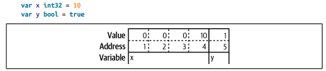
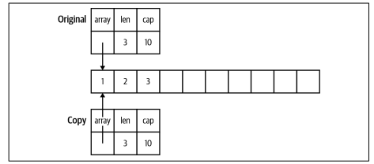

# Pointers

<!--toc:start-->
- [Pointers](#pointers)
  - [A Quick Pointer Primer](#a-quick-pointer-primer)
  - [Pointers Indicate Mutable Parameters](#pointers-indicate-mutable-parameters)
  - [Pointers Are a Last Resort](#pointers-are-a-last-resort)
  - [Pointer Passing Performance](#pointer-passing-performance)
  - [The Zero Value Versus No Value](#the-zero-value-versus-no-value)
  - [The Difference Between Maps and Slices](#the-difference-between-maps-and-slices)
  - [Slices as Buffers](#slices-as-buffers)
  - [Reducing the Garbage Collector's Workload](#reducing-the-garbage-collectors-workload)
  - [Wrapping Up](#wrapping-up)
<!--toc:end-->

## A Quick Pointer Primer
A Pointer is simply a variable that holds the location in memory where a value is stored. The diagram below illustrates how variables are stored in memory:



Every variable is stored in one or more contiguous memory locations, called *addresses*. Different types of variables take up different amounts of memory. In the above example, `x` is a 32-bit int and `y` is a boolean. A 32-bit int requires four bytes, A boolean only requires a single byte(you only need a bit to represent true and false, but the smallest amount of memory that can be independently addressed is a byte).

A pointer is a variable whose contents are the address where another variable is stored:


Every pointer , no matter what type it points to, is always the same size: a number that holds the location in memory where the data is stored.

The zero value for a pointer is `nil`. We've seen `nil` a few times before as the zero value for slices, maps, and functions. All of these types are implemented with pointers(two more types, interfaces and channels, are also implemented with pointers, we'll cover them in later sections).

Go's pointer syntax is partially borrowed from C and C++. Since Go has a garbage collector, most of the pain of memory management is removed. Also note that some of the tricks you can do with pointers in C and C++, like *pointer arithmetic*, are not allowed in Go.

The `&` is the address operator. It precedes a value type and returns the address of the memory location where the value is stored:
```go
x := "hello"
pointerToX := &x
```
The `*` is the *indirection* operator. It precedes a variable of pointer type and returns the pointer-to value. This is also called *dereferencing*:
```go
x := 10
pointerToX := &x
fmt.Println(pointerToX) // prints a memory address
fmt.Println(*pointerToX) // prints 10
z := 5 + *pointerToX
fmt.Println(z) // prints 15
```
Before dereferencing a pointer you have to make sure that the pointer is non-nil otherwise your program will panic
```go
var x *int
fmt.Println(x == nil) // prints true
fmt.Println(*x) // panics
```
A pointer type is a type that represents a pointer. It is written with a `*` before a type name:
```go
x := 10
var pointerToX *int
pointerToX = &x
```
For structs, use an `&` before a struct literal to create a pointer instance. You can't use an `&` before a primitive literal or a constant because they don't have memory addresses, they exist only at compile time. If you need a pointer to a primitive type, declare a variable and point to it:
```go
x := &Foo{}
var y string
z := &y
```
If you have a struct with  a field  of a pointer to a primitive you can't assign a literal directly to the field:
```go
type person struct {
  FirstName string
  MiddleName *string
  LastName string
}

p := person {
  FirstName: "Pat",
  MiddleName: "Perry", // error: cannot use "Perry" (type string) as type *string in field value
  LastName: "Peterson",
}
```
If you try to put an `&` operator before `"Perry"` you'll get this error: `cannot take the address of "Perry"`

To fix this you can either introduce a variable to hold the constant value or write a helper function that takes in a primitive type and returns a pointer to that type:
```go
func stringp(s string) *string {
  return &s
}
p := person {
  FirstName: "Pat",
  MiddleName: stringp("Perry"),
  LastName: "Peterson",
}
```
This works because when we pass a constant to a function, the constant is copied to a parameter which is variable. Since it's a variable, it has an address in memory.

## Pointers Indicate Mutable Parameters
The lack of immutable declaration in Go might seem problematic, but the ability to choose between value and pointer parameter types addresses the issue. Using mutable objects is just fine if you are using them entirely locally within a method, and with only one reference to the object. Rather than declare that some variables and parameters are immutable, Go developers use pointers to indicate that a parameter is mutable.

Because Go is call by value, values passed to functions are copies. For non-pointer types like primitives, structs, and arrays, this means that the called function cannot modify the original.

However, if a point is passed to a function, the function gets a copy of the pointer. This still points to the original data, which means that the original data can be modified by the called function.

Bear in mind that if you pass a `nil` pointer to a function, you cannot make the value non-nil. You can only reassign the value if there was a value already assigned to the pointer. This is confusing at first but it makes sense. Since the memory location was passed to the function via call-by-value, we can't change the memory address any more than we could change the value of an `int` parameter:
```go
func failedUpdate(g *int) {
  x := 10
  g = &x
}

func main() {
  var f *int // f is nil
  failedUpdate(f)
  fmt.Println(f) // prints nil
}
```
Here is a visual representation of this code:


The second thing to keep in mind when copying a pointer is that if you want the value assigned to a pointer parameter to still be there when you exit the function, you must dereference the pointer and set the value. If you change the pointer, you have changed the copy, no the original. Dereferencing puts the new value in the memory location pointed to by both the original and the copy. Here's an example:
```go
func failedUpdate(px *int) {
  x2 := 20
  px = &x2
}

func update(px *int) {
  *px = 20
}

func main() {
  x := 10
  failedUpdate(&x)
  fmt.Println(x) // 10
  update(&x)
  fmt.Println(x) // 20
}
```
## Pointers Are a Last Resort
You should be careful when using pointers, they make it harder to understand data flow and can create extra work for the garbage collector. Instead of populating a struct by passing a pointer to it into a function, have the function instantiate and return the struct:
```go
// Don't do this
func MakeFoo(f *Foo) error {
  f.Field1 = "val"
  f.Field2 = 20
  return nil
}
// Do this
func MakeFooV2() (Foo, error) {
  f := Foo{
    Field1: "val",
    Field2: 20,
  }
  return f, nil
}
```
When returning values from a function, you should favor value types. Only use a pointer type as a return type if there is state within the data type that needs to be modified. An example of this would be a buffer for reading or writing data and there are some types that are used with concurrency that must always be passed as pointers.

## Pointer Passing Performance
If a struct is large enough, there are performance improvements from using a pointer to the struct as either an input parameter or a return value. Be aware that in the vast majority of cases the differences are very minor and won't affect your program's performance. But if you are passing megabytes of data between functions, consider using a pointer even if the data is meant to be immutable.

## The Zero Value Versus No Value
Another common usage of pointers in Go is to indicate the difference between a variable or field that's been assigned the zero value and a variable or field that hasn't been assigned a value at all. If this distinction matters you can use a `nil` pointer to represent an unassigned value or struct field.

Because pointers indicate mutability, be careful when using this pattern. Instead of returning a pointer set to `nil` from a function, use the comma ok idiom that we saw for maps and return a value type and a boolean. Remember that a `nil` pointer that is passed into a function via a parameter or a field on a parameter cannot have a value set within the function.

## The Difference Between Maps and Slices
We saw previously that modifications made to a map that's passed to a function are reflected in the original variable. Now that we understand pointers we know why: within the Go runtime, a map is implemented as a pointer to a struct.

Because of this you should avoid using maps for input parameters or return values, especially on public APIs. On an API-design level, maps are a bad choice because they say nothing about what values are contained within. There's nothing that explicitly defines what keys are in the map, so the only way to know what they are is to trace through the code. The are also bad from an immutability standpoint because the only way to know what ended up in the map is to trace through all of the functions that interact with it. This prevents your API from being self-documenting.

Slice are different, any modifications to the contents of the slice are reflected in the original variable but using `append` to change the length isn't reflected even if the slice has a capacity greater than its length. That's because a slice is implemented as a struct with three fields: an `int` field for length, an `int` field for capacity, and a pointer to a block of memory:



When a slice is copied to a different variable or passed to a function, a copy is made of the length, capacity, and the pointer. Changing the values in the slice changes the memory that the pointer points to, so the changes are seen in both the copy and the original. Changes to the length and capacity are not reflected back in the original because they are only in the copy.

The result is that a slice that's passed to a function can have its contents modified, but the slice can't be resized. Slices are frequently passed around in Go programs. By default, you should assume that a slice is not modified by a function and your function's documentation should specify if it modifies the slice's contents.

## Slices as Buffers
When reading from an external resource(like a file or network connection), many languages use code like this:
```
r = open_resource()
while r.has_data() {
  data_chunk = r.next_chunk()
  process(data_chunk)
}
close(r)
```
The problem with this pattern is that every time we iterate through the `while` loop we allocate another `data_chunk` even though each one is used only once. This creates lots of unnecessary memory allocations.

Even though Go is a garbage-collected language, writing idiomatic Go means avoiding unneeded allocations. Rather than returning a new allocation each time we read from a data source we create a slice of bytes once and use it as a buffer to read data from the data source.
```go
file, err := os.Open(fileName)
if err != nil {
  return err
}
defer file.Close()
data := make([]byte, 100)
for {
  count, err := file.Read(data)
  if err != nil {
    return err
  }
  if count == 0 {
    return nil
  }
  process(data[:count])
}
```
## Reducing the Garbage Collector's Workload
Using buffers is just one example of how we can reduce the work done by the garbage collector. In programming "garbage" refers to data that has no more pointers pointing to it. Once there are no more pointers to data, the memory that this data takes up can be reused, if the memory isn't recovered, the program's memory would continue to grow till the computer ran out of memory.

The job of the garbage collector is to automatically detect unused memory and recover it so it can be reused. Go has a garbage collector but just because we have a garbage collector doesn't mean we should create lots of garbage.

A stack is a consecutive block of memory, and every function call in a thread of execution shares the same stack. Allocating memory on the stack is fast and simple. A *stack pointer* tracks the last location where memory was allocated, allocating additional memory is done by moving the stack pointer. When a function is invoked, a new *stack frame* is created for the function's data. Local variables are stored on the stack, along with parameters passed into a function. Each new variable moves the stack pointer by the size of the value. When a function exits, its return values are copied back to the calling function via the stack and the stack pointer is moved back to the beginning of the stack frame for the exited function. This deallocates all of the stack memory that was used by that function's local variables and parameters.

To store something on the stack, you have to know exactly how big it is at compile time. The value types in Go(primitive values, arrays, and structs) all have one thing in common, we know exactly how much memory they will take at compile time meaning they can be stored on the stack instead of the heap. The size of a pointer type is also know, and it is also stored on the stack.

In order for Go to allocate the data pointers point to on the stack several conditions must be true. It must be a local variable whose data size is known at compile time. The pointer cannot be returned from a function. If the pointer is passed into a function, the compiler must be able to ensure that these conditions still hold. If the compiler determines that the data can't be stored on the stack, we say that the data *escapes* the stack and is stored on the heap.

The heap is the memory that's managed by the garbage collector(or by hand in languages like C and C++). Any data that's stored on the heap is valid as long as it can be tracked back to a pointer type variable on a stack. Once there are no more pointers pointing to the data, the data becomes *garbage* and it's the job of the garbage collector to clear it out.

The *escape analysis* done by the Go compiler isn't perfect, there are some instance where data that could have been stored on the stack escapes to the heap. However, the compiler has to be conservative. It can't take the chance of leaving a value on the stack when it might need to be on the heap because leaving a reference to invalid data causes memory corruption.

Storing things on the heap can cause some performance related problems. The first is that the garbage collector takes time to do it' work and it isn't trivial to keep track of all the available chunks of free memory or tracking which used blocks of memory still have valid pointers. This is time taken away from doing the processing your program was written to do. The garbage collector used by Go favors low latency(finishes garbage scans quickly instead of trying to find the most garbage in each scan). However, if your Go program creates lots of garbage the garbage collector won't be able to find all the garbage during a cycle, slowing down the collector and increasing memory usage.

The second problem deals with the nature of computer hardware. The fastest way to read from memory is to read it sequentially. A slice of structs has all the data laid out sequentially in memory, making it fast to process. A slice of pointers to structs(or structs whose fields are pointers) has its data scattered across RAM, making it far slower to read and process.

Now you can see why Go encourages you to use pointers sparingly. We reduce the workload of the garbage collector by making sure that as much as possible is stored on the stack. Slices of structs or primitive types have their data lined up sequentially in memory for rapid access. And when the garbage collector does do work, it is optimized to return quickly rather than gather the most garbage. The key to making this approach work is to simply create less garbage in the first place. While focusing on optimizing memory allocations can feel like premature optimization, the idiomatic approach in Go is also the most efficient.

> **_NOTE:_** Check out the following resources to learn more about heap vs stack allocation and escape analysis: 
> - [Ardan Labs](https://www.ardanlabs.com/blog/2017/05/language-mechanics-on-stacks-and-pointers.html), 
> - [Segment](https://segment.com/blog/allocation-efficiency-in-high-performance-go-services/)

## Wrapping Up
This section covered pointers, what they are, how to use them, and when to use them. The [next section](./06_types_methods_and_interfaces.md) will look at Go's implementation of methods, interfaces, and types.
