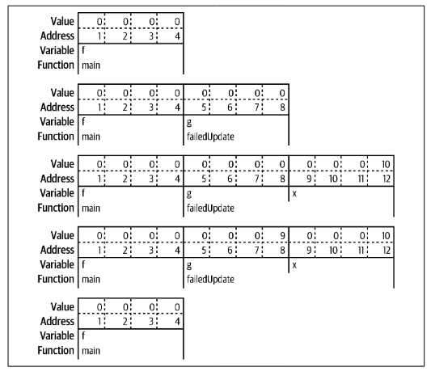
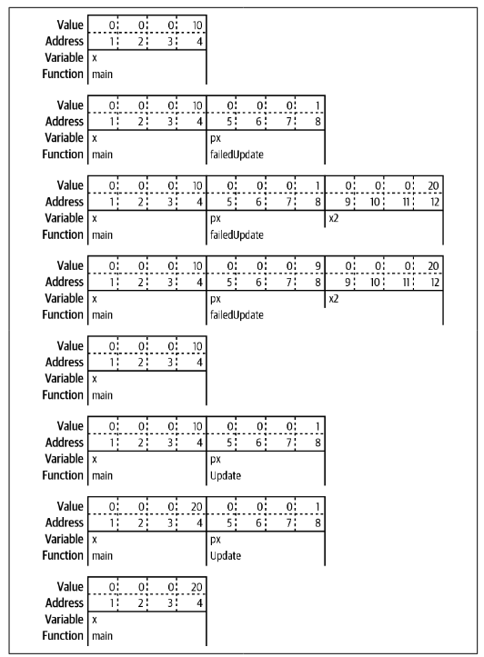
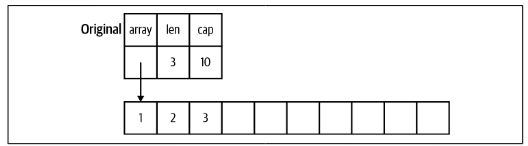
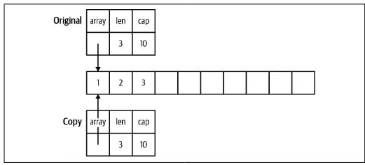
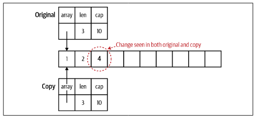
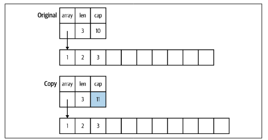
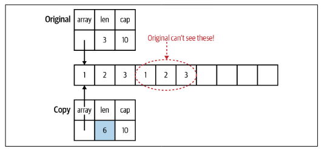

# Pointers

<!--toc:start-->
- [Pointers](#pointers)
  - [A Quick Pointer Primer](#a-quick-pointer-primer)
  - [Don't Fear the Pointers](#dont-fear-the-pointers)
  - [Pointers Indicate Mutable Parameters](#pointers-indicate-mutable-parameters)
  - [Pointers Are a Last Resort](#pointers-are-a-last-resort)
  - [Pointer Passing Performance](#pointer-passing-performance)
  - [The Zero Value Versus No Value](#the-zero-value-versus-no-value)
  - [The Difference Between Maps and Slices](#the-difference-between-maps-and-slices)
  - [Slices as Buffers](#slices-as-buffers)
  - [Reducing the Garbage Collector's Workload](#reducing-the-garbage-collectors-workload)
  - [Wrapping Up](#wrapping-up)
<!--toc:end-->

This section will cover how and when to use pointers, how memory is allocated in Go, and how using pointers and values properly makes Go programs faster and more efficient.

## A Quick Pointer Primer
A pointer is simply a variable that holds the location in memory where a value is stored. Here is a visual representation of how two variables are stored in memory:


Every variable is stored in one or more contiguous memory locations called *addresses*. Different types of variables take up different amounts of memory. In the above example, `x` is a 32-bit int, and `y` is a boolean. Storing a 32-bit int requires four bytes, so the value of x is stored in four bytes, starting at address 1 and ending at address 4. A boolean only needs a single bit, but the smallest amount of memory that can be independently addressed is a byte so the value for `y` is stored in one byte at address 5.

A pointer is simply a variable whose contents are the address where another variable is stored:


Every pointer, no matter what type it is pointing to, is always the same size: a number that holds the location in memory where the data is stored. `pointerX` is stored at location 6 and has a value of 1, the address of `x`. Similarly, `pointerY` is stored at location 10 and has a value of 5, the address of `y`. The last pointer, `pointerZ`, is stored at location 14 and has a value of 0 because it doesn't point to anything.

The zero value for a pointer is `nil`. We've seen `nil` a few times already as the zero value for slices, maps, and functions. All of these types are implemented with pointers(channels and interfaces are also implemented with pointers). As we covered in [section 3](./3_composite_types.md), `nil` is an untyped identifier that represents the lack of a value for certain types. Unlike `NULL` in C, `nil` is not another name for 0 and you can't convert it back and forth with a number.

> The Go standard library does have an `unsafe` package that lets you do some low-level operations on data structures. Pointer manipulation is used in C for common operations, but it is exceedingly rare for Go developers to use `unsafe`. We'll look at `unsafe` in [section 14](./14_here_there_be_dragons:reflect_unsafe_and_cgo.md).

The `&` is the *address* operator. It precedes a value type and returns the address of the memory location where the value is stored:

```go 
x := "hello"
pointerToX := &x
```

The `*` is the *indirection* operator. It precedes a variable of pointer type and returns the pointed to value, this is called *dereferencing*.

```go 
x := 10
pointerToX := &x 
fmt.Println(pointerToX)  // prints a memory address
fmt.Println(*pointerToX) // prints 10
z := 5 + *pointerToX
fmt.Println(z)           // prints 15
```

Before dereferencing a pointer, you must make sure that the pointer is non-nil. Your program will panic if you attempt to dereference a `nil` pointer: 

```go 
var x *int 
fmt.Println(x == nil) // prints true
fmt.Println(*x)       // panics
```

A *pointer type* is a type that represents a pointer. It is written with a `*` before a type name. The built-in function `new` creates a pointer variable. It returns a pointer to a zero value instance of the provided type:

```go 
var x = new(int)
fmt.Println(x == nil) // prints false
fmt.Println(*x)       // prints 0
```

For structs, use an `&` before a struct literal to create a pointer instance. You can't use an `&` before a primitive literal(numbers, booleans, and string) or a constant because they don't have memory addresses; they exist only at compile time. When you need a pointer to a primitive type, declare a variable and point to it:

```go 
x := &Foo{}
var y string 
z := &y
```

Not being able to take the address of a constant is sometimes inconvenient. If you have a struct with a field of a pointer to a primitive type, you can't assign a literal directly to the field:

```go 
type person struct {
    Firstname string 
    MiddleName *string 
    LastName string
}

p := person {
    Firstname: "Pat",
    MiddleName: "Perry", //This line won't compile
    LastName: "Peterson",
}
```

This code returns an error:

```shell
cannot use "Perry" (type string) as type *string in field value
```

If you try to put an `&` before `"Perry"`, you'll get the error message:

```shell 
cannot take the address of "Perry"
```

There are a couple ways around this problem. The first is to introduce a variable to hold the constant value. The second is to write a helper function that takes in a boolean, numeric, or string type and returns a pointer to that type:

```go 
func stringp(s string) *string {
    return &s
}

p := person {
    FirstName: "Pat",
    MiddleName: stringp("Perry"), // This works
    LastName: "Peterson",
}
```

Here the constant is copied to a parameter, which is a variable. Since it's a variable, it has an address in memory which we can return.

## Don't Fear the Pointers
In other languages like Java there is a difference in the behavior between primitive types and classes. When a primitive values is assigned to another variable or passed to a function or method, any changes made to the other variables aren't reflected in the original:

```java 
int x = 10;
int y = x;
y = 20;
System.out.println(x); // prints 10
```

Let's see what happens when an instance of a class is assigned to another variable or passed to a function or method(the example is written in Python):

```go 
class Foo:
    def __init__(self, x):
        self.x = x 

def outer():
    f = Foo(1)
    inner1(f)
    print(f.x) // 20
    inner2(f)
    print(f.x) // 20
    g = None 
    inner2(g)
    print(g is None) // True

def inner1(f):
    f.x = 20

def inner2(f):
    f = Foo(30)

outer()
```

The following things are true in Java, Python, JavaScript, and Ruby:
- If you pass an instance of a class to a function and you change the value of a field, the change is reflected in the variable that was passed in.
- If you reassign the parameter, the change is *not* reflected in the variable that was passed in.
- If you pass `nil/null/None` for a parameter value, setting the parameter itself to a new value doesn't modify the variable in the calling function.

Some people explain this behavior by saying that class instances are passed by reference in these languages. This is untrue. If they were being passed by reference, cases two and three would change the variable in the calling function. These languages are always pass-by-value, just like Go.

What we are seeing is that every instance of a class in these languages is implemented as a pointer. When a class instance is passed to a function or method, the value being copied is the pointer to the instance. Since `outer` and `inner1` are referring to the same memory, changes made to the fields in `f` by `inner1` are reflected in the variable in `outer`. `inner2` reassigns `f` to a new class instance, this creates a separate instance and does not affect the variable in `outer`.

The difference between Go and these languages is that Go gives you the *choice* to use pointers or values for both primitives and structs. Most of the time you should use a value since they make it easier to understand how and when your data is modified. They also reduce the amount of work that the garbage collector has to do(we'll talk more about this [later in this section](#reducing-the-garbage-collectors-workload)).

## Pointers Indicate Mutable Parameters
We've seen earlier that constants in Go provide names for literal expressions that can be calculated at compile time and that there is no way to declare that other kinds of values are immutable. Modern software engineering embraces immutability. So the lack of immutable declarations in Go might seem problematic, but the ability to choose between value and pointer parameter types addresses this issue. [MIT's Software Construction course](https://web.mit.edu/6.031/www/fa20/classes/08-immutability/) explains "[U]sing mutable objects is just fine if you are using them entirely locally within a method, and with only one reference to the object". Rather than declare that some variables and parameters are immutable, Go developers use pointers to indicate that a parameter is mutable.

Since Go is a call by value language, the values passed to functions are copies. For non-pointer types like primitives, structs, and arrays, this means that the called function cannot modify the original. Since the called function has a copy of the of the original data, the immutability of the original data is guaranteed.

However, if a pointer is passed to a function, the function gets a copy of the pointer. This still points to the original data, which means the original data can be modified by the called function. This leads us to a couple related implications

The first implication is that when you pass a `nil` pointer to a function, you cannot make the value non-nil. You can only reassign the value if there was a value already assigned to the pointer. Since the memory location was passed to the function via call-by-value, we can't change the memory address, any more than we could change the value of an `int` parameter. 

```go 
func failedUpdate(g *int) {
    x := 10
    g = &x
}

func main() {
    var f *int // f is nil 
    failedUpdate(f)
    fmt.Println(f) // prints nil
}
```

Let's look at a visual representation of this code:



The second implication of copying a pointer is that if you want the value assigned to a pointer parameter to still be there when you exit the function you must dereference the pointer and set the value. Remember, if you change the pointer, you have changed the copy, not the original. Dereferencing puts the new value in the memory location pointed to by both the original and the copy. 

```go 
func failedUpdate(px *int) {
    x2 := 20 
    px = &x2
}

func update(px *int) {
    *px = 20
}

func main() {
    x := 10
    failedUpdate(&x)
    fmt.Println(x) // prints 10 
    update(&x) 
    fmt.Println(x) // prints 20
}
```

Let's take another look at a visual representation:



## Pointers Are a Last Resort
Pointers make it harder to understand data flow and can create extra work for the garbage collector. Instead of populating a struct by passing a pointer to it into a function, have the function instantiate and return the struct:

```go 
// Don't do this 
func MakeFoo(f *Foo) error {
    f.Field1 = "val"
    f.Field2 = 20 
    return nil
}

// Do this 
func MakeFooV2() (Foo, error) {
    f := Foo{
        Field1: "val",
        Field2: 20,
    }
    return f, nil
}
```

The only time you should use pointer parameters to modify a variable is when the function expects an interface. You see this pattern when working with JSON. This pattern is used because Go didn't have generics till recently, meaning there wasn't a convenient way to pass a type into a function to specify what to unmarshal into nor was there a way to specify a different return type for different types.

When returning values from a function, you should favor value types. Only use a pointer type as a return type if there is state within the data type that needs to be modified. We'll see this when looking at I/O with buffers for reading or writing data. Additionally, there are data types that are used with concurrency that must always be passed as pointers, more on those in [section 10](./10_concurrency_in_go.md).

## Pointer Passing Performance
If a struct is large enough, there are performance improvements from using a pointer to the struct as either an input parameter or a return value. The time to pass a pointer into a function is constant for all data sizes, roughly one nanosecond. Passing a value into a function takes longer as the data gets larger, it takes about a millisecond once the value gets to be around 10 megabytes of data.

The behavior for returning a pointer versus returning a value is a little different. For data structures smaller than a megabyte, it is actually *slower* to return a pointer type than a value type. A 100-byte data structure takes around 10 nanoseconds to be returned, but a pointer to that data structure takes about 30 nanoseconds. Once your data structures are larger than a megabyte, the performance advantage flips. 

Note that these are very short times and for the vast majority of cases the different between using a pointer and a value won't affect your program's performance. But if you are passing megabytes of data between functions, consider using a pointer even if the data is meant to be immutable.

## The Zero Value Versus No Value
Another common usage of pointers in Go is to indicate the difference between a variable or field that's been assigned the zero value and a variable or field that hasn't been assigned a value at all. If this distinction matters you can use a `nil` pointer to represent an unassigned variable or struct field.

However, because pointers indicate mutability be careful when using this pattern. Rather than return a pointer set to `nil` from a function you can use the comma ok idiom and return a value type and a boolean.

JSON conversions are an exception. When converting data back and forth from JSON(we'll cover JSON support in Go's standard library in [a later section](./11_standard_library.md#encoding-and-decoding-json)), you often need a way to differentiate between the zero value and not having a value assigned at all. Use a pointer value for fields in the struct that are nullable.

When not working with JSON(or other external protocols), resist the temptation to use a pointer field to indicate no value. While it does provide a handy way to indicate no value, if you are going to modify the value, you should use a value type instead, paired with a boolean.

## The Difference Between Maps and Slices
Within the Go runtime, a map is implemented as a pointer to a struct. Passing a map to a function means that you are copying a pointer.

Because of this, you should avoid using maps for input parameters or return values, especially on public APIs. On an API-design level, maps are a bad choice because they say nothing about what values are contained within. The only way to know what keys are in the map is to trace through the code. From an immutability standpoint, maps are bad because the only way to know what ended up in the map is to trace through all of the functions that interact with it. Instead of passing a map around, use a struct(we'll see another reason to prefer structs when we talk about memory layout in ["Reducing the Garbage Collector's Workload"](#reducing-the-garbage-collectors-workload)).

Passing in a slice to a function is more complicated. Any modification to the contents of the slice is reflected in the original variable, but using `append` to change the length isn't reflected in the original variable, even if the slice has a capacity greater than its length. That's because a slice is implemented as a struct with three fields: an `int` field for its length, an `int` field for capacity, and a pointer to a block of memory:



When a slice is copied to a different variable or passed to a function, a copy is made of the length, capacity, and the pointer:



Changing the values in the slice changes the memory that the pointer points to so the changes are seen in both the copy and the original:



Changes to the length and capacity are not reflected back in the original, because they are only in the copy. Changing the capacity means that the pointer is now pointing to a new bigger block of memory:



If the slice copy is appended to and there is enough capacity to not allocate a new slice, the length changes in the copy and the new values are stored in the  block of memory that's shared by the copy and the original. However, the length of the original slice remains unchanged. This means the Go runtime prevents the original slice from seeing those values that are beyond the length of the original slice.



The result is that a slice that's passed to a function can have its contents modified but it can't be resized. As the only linear data structure, slices are frequently passed around in Go programs. By default, you should assume that a slice is not modified by a function. A function's documentation should specify if it modifies a slice's contents.

> The reason you can pass a slice of any size to a function is that the data that's passed to the function is the same for any size slice: two `int` values and a pointer.

## Slices as Buffers
When reading data from an external resource(like a file or network connection) man languages use code like this:

```java 
r = open_resource()
while r.has_data() {
    data_chunk = r.next_chunk()
    process(data_chunk)
}
close(r)
```

The problem with this pattern is that every time we iterate through the `while` loop, we allocate another `data_chunk` even though each one is only used once. This creates lots of unnecessary memory allocations which means more work for the garbage collector.

Idiomatic Go means avoiding unneeded allocations. Rather than returning a new allocation each time we read from a data source, we create a slice of bytes once and use it as a buffer to read data from the data source:

```go 
file, err := os.Open(fileName)
if err != nil {
    return err
}
defer file.Close()
data := make([]byte, 100)
for {
    count, err := file.Read(data)
    if err != nil {
        return err
    }
    if count == 0 {
        return nil
    }
    process(data[:count])
}
```

Here we create a buffer of 100 bytes and each time through the loop we copy the next block of bytes(up to 100) into the slice. We then pass the populated portion of the buffer to `process`. We'll discuss more details about I/O in ["io and Friends"](./11_standard_library.md#io-and-friends).

## Reducing the Garbage Collector's Workload
Using buffers is just one example of how to reduce the work done by the garbage collector. When programmers talk about "garbage" they are referring to "data that has no more pointers pointing to it". Once there are no more pointers pointing to some data, the memory that this data takes up can be reused.

If you've spent time learning how programming languages are implemented, you've at least heard about the *heap* and the *stack*. A stack is a consecutive block of memory, and every function call in a thread of execution shares the same stack. Allocating memory on the stack is fast and simple. A *stack pointer* tracks the last location where memory was allocated, allocating additional memory is done by moving the stack pointer. When a function is invoked, a new *stack frame* is created for the function's data. Local variables are stored on the stack along with parameters passed into a function. Each new variable moves the stack pointer by the size of the value. When a function exits, its return values are copied back to the calling function via the stack and the stack pointer is moved back to the beginning of the stack frame for the exited function, deallocating all of the stack memory that was used by the function's local variables and parameters.

> Go is unusual in that it can actually increase size of a stack while the program is running. This is possible because each goroutine has its own stack and goroutines are managed by the Go runtime not the underlying operating system(we'll cover goroutines in [section 10](./10_concurrency_in_go.md)).

To store something on the stack you have to know exactly how big it is at compile time. When we look at the value types in Go(primitive values, array, and structs), they all have on thing in common: we know exactly how much memory they will take up at compile time. The size of a pointer type is also know, and it is also stored on the stack.

The rules are more complicated for the data that the pointer points to. In order for Go to allocate the data the pointer points to on the stack, several conditions must be true. It must be a local variable whose data size is known at compile time. The pointer cannot be returned from a function. If the pointer is passed into a function, the compiler must be able to ensure that these conditions still hold. If the size isn't known, you can't make space for it by simply moving the stack pointer. If the pointer variable is returned, the memory that the pointer points to will no longer be valid when the function exits. When the compiler determines that the data can't be stored on the stack, we say that the data the pointer points to *escapes* the stack and the compiler stores the data on the heap.

The heap is the memory that's managed by the garbage collection(or by hand in languages like C and C++). Any data that's stored on the heap is valid as long as it can be tracked back to a pointer type variable on a stack. Once there are no more pointers pointing to that data, the data becomes *garbage* and it's the job of the garbage collector to clear it out.

> A common source of bugs in C programs is returning a pointer to a local variable. In C, this results in a pointer pointing to invalid memory. When the Go compiler sees that a pointer to a local variable is returned, the local variable's value is store don the heap.

The *escape analysis* done by the Go compiler isn't perfect. There are some cases where data that could be stored on the stack escapes to the heap. However, the compiler has to be conservative. It can't leave a value on the stack when it might need to be on the heap because leaving a reference to invalid data causes memory corruption.

There are some performance related reasons why we want to avoid storing things on the heap. The first is that the garbage collector takes time to do its work. It isn't trivial to keep track of all the available chunks of free memory on the heap or tracking which used blocks of memory still have valid pointers. This is time taken away from doing the processing that your program is written to do. There are two rough categories of garbage collection algorithms: those that are designed for higher throughput(find the most garbage possible in a single scan) or lower latency(finish the garbage scan as quickly as possible). The garbage collector used by the Go runtime favors low latency. Each garbage collection cycle is designed to take less that 500 microseconds. However, if your Go program creates lots of garbage, then the garbage collector won't be able to find all the garbage during a cycle, slowing down the collector and increasing memory usage.

> If you are interested in the implementation details, you may want to read or listen to Rick Hudson describing the [history and implementation](https://go.dev/blog/ismmkeynote) of the Go garbage collector.

The second problem deals with the nature of computer hardware. RAM might mean "random access memory", but the fastest way to read from memory is to read it sequentially. A slice of structs in Go has all of the data laid out sequentially in memory, making it fast to load and fast to process. A slice of pointers to structs(or structs whose fields are pointers) has its data scattered across RAM, making it far slower to read and process.

Now we can see why Go encourages you to use pointers sparingly. We reduce the workload of the garbage collector by making sure as much as possible is stored on the stack. And when the garbage collector does do work, it is optimized to return quickly rather than gather the most garbage. The key to making this approach work is to simply create less garbage in the first place. While focusing on optimizing memory allocations can feel like premature optimization, the idiomatic approach in Go is also the most efficient.

If you want to learn more about heap vs stack allocation and escape analysis read this [blog post by Bill Kennedy of Arden Labs](https://www.ardanlabs.com/blog/2017/05/language-mechanics-on-stacks-and-pointers.html).

## Wrapping Up
In this section we learned about pointers, what they are, how to use them, and most importantly, when to use them. The [next section](./7_types_methods_interfaces.md) will cover Go's implementation of methods, interfaces, and types.
