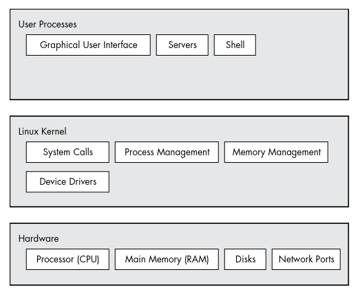
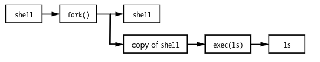
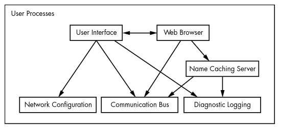

# The Big Picture
The most effective way to understand how an operating system works is through *abstraction* - a fancy way of saying that you can ignore most of the details that make up a piece that you are trying to understand, and concentrate instead on its basic purpose and operation.

There are many terms for an abstracted subdivision in computer software including *subsystem*, *module*, and *package* but for simplicity we'll use the term *component*. When building a software component developers typically don't think much about the internal structure of other components, but they do consider other components they can use and how to use them.

This section will provide a high level overview of the components that make up a Linux system. The focus will be to understand what the components do in relation to the whole system, following section will look at each component in more detail.

## Levels and Layers of Abstraction in a Linux System
A Linux system has three main levels as show below and some components inside each level

The hardware level is at the base of the system and it includes memory as well as CPUs to perform computation and to read from and write to memory. Devices such as disks and network interfaces are also part of the hardware layer.

The next level up is the *kernel*, which is the core of the operating system. The kernel is software that resides in memory that tells the CPU where to look for its next task. The kernel manages the hardware, especially main memory, and is the primary interface between the hardware and any running program.

*Processes*, the running programs that the kernel manages, collectively make up the system's upper level which is called *user space*. A more specific term for process is *user process*, regardless of whether a user directly interacts with the process. For example, all web servers run as user processes.

There is a critical difference between how the kernel and the user processes run: the kernel runs in *kernel mode*, and the user processes run in *user mode*. Code running in kernel mode has unrestricted access to the CPU and main memory. This is a powerful and dangerous privilege that allows the kernel to easily corrupt and crash the entire system. The memory area that only the kernel can access is called *kernel space*.

User mode restricts access to a, usually quite small, subset of memory and safe CPU operations. *User space* refers to the parts of main memory that user processes can access. If a process makes a mistake and crashes, the consequences are limited and can be cleaned up by the kernel.

In theory, a user process gone haywire can't cause serious damage to the rest of the system. In reality, it depends on what you consider "serous damage" as well as the particular privileges of the process.

> **_NOTE:_** The Linux kernel can run kernel threads, which look much like processes but have access to kernel space. Some examples are `kthreadd` and `kblockd`.

## 1.2 Hardware: Understanding Main Memory
Of all the hardware on a computer system, *main memory* is perhaps the most important. Put most simply it is just a big storage area for a bunch of *bits*. This is where the running kernel and processes reside, all input and output from peripheral devices flows through main memory. A CPU is just an operator on memory; it reads its instructions and data from the memory and writes data back out to memory.

You'll often hear the term *state* in reference to memory, processes, the kernel, and other parts of a computer system. Strictly speaking, state is a particular arrangement of bits but most people use it to describe what something has done or is doing at the moment. Ex: "The process is waiting for input" or "The process is performing Stage 2 of its startup". 

## 1.3 The Kernel
The kernel is in charge of managing tasks in four general areas:
- **Processes**: Determining which processes are allowed to use the CPU
- **Memory**: The kernel needs to keep track of all memory - what is currently allocated to a particular process, what might be shared between processes, and what is free.
- **Device drivers**: The kernel acts as an interface between hardware and processes. It's is usually the kernel's job to operate the hardware
- **System calls and support**: Processes normally use system calls to communicate with the kernel

> **_NOTE:_** To get a more detailed understanding of a kernel *Operating System Concepts* by Abraham Silberschatz, Peter B. Galvin, and Greg Gagne is a great resource

### 1.3.1 Process Management
*Process management* describes the starting, pausing, resuming, scheduling, and terminating of processes. On any modern operating system, many processes run "simultaneously". You might have a web browser and a spreadsheet open at the same time. However, the processes behind these applications typically don't run at *exactly* the same time. 

In practice, each process uses the CPU for a small fraction of a second, then pauses; then another process uses the CPU for another small fraction of a second; then another and so on. The act of one process giving up control of the CPU to another process is called a *context switch* and each piece of time is called a *time slice*. Each time slice gives a process enough time for significant computation. However, because the slices are so small, humans can't perceive them and the system appears to be running multiple processes at the same time.

The kernel is responsible for handling context switching. Here is what happens when the time slice for a process running in user mode ends:

1. The CPU interrupts the current process based on an internal timer, switches into kernel mode, and hands control back to the kernel
2. The kernel records the current state of the CPU and memory, this is needed to resuming the process that was just interrupted
3. The kernel performs any tasks that might have come up during the preceding time slice(such as collecting data from I/O operations)
4. The kernel is now ready to let another process run so it analyzes the list of processes that are ready and chooses one
5. The kernel prepares the memory for the new process and then prepares the CPU
6. The kernel tells the CPU how long the time slice for the new process will last
7. The kernel switches the CPU into user mode and hands control of the CPU to the process

In the case of a multi-CPU system the kernel doesn't need to relinquish control of its current CPU in order to allow a process to run on a different CPU, and more than one process may run at a time. However, to maximize the usage of all available CPUs, the kernel typically performs these steps anyway.

### 1.3.2 Memory Management
The kernel must manage memory during a context switch, which can be a complex job. To do so the following conditions must hold:

- The kernel must have its own private are in memory that user processes can't access
- Each user process needs its own section of memory
- One user process may not access the private memory of another process
- User processes can share memory
- Some memory in user processes can be read-only
- The system can use more memory than is physically present by using disk space as auxiliary

Modern CPUs include a *memory management unit(MMU)* than enables a memory access scheme called *virtual memory*. When using virtual memory, a process does not directly access the memory by its physical location in the hardware. Instead, the kernel sets up each process to act as if it had an entire machine to itself. When the process accesses some of its memory, the MMU intercepts the access and uses a memory address map to translate the memory location from the process point of view into an actual physical memory location in the machine. The kernel has to initialize and continuously maintain and alter this memory address map and during a context switch change the map from the outgoing process to the incoming process.

> **_NOTE:_** The implementation of a memory address map is called a page table

### 1.3.3 Device Drivers and Management 
A device is typically accessible only in kernel mode because improper access could crash the machine. A notable difficult is that different devices rarely have the same programming interface, even if the devices perform the same task(for example, two different network cards). Therefore, device drivers have traditionally been part of the kernel, and they strive to present a uniform interface to user processes in order to simplify the software developer's job.

### 1.3.4 System Calls and Support
*System calls*(or *syscalls*) perform specific tasks that a user process alone cannot do well or at all. For example, opening, reading, and writing to files all involve system calls.

Two system calls, `fork()` and `exec()`, are important in understanding how processes start:
- **`fork()`** - When a process calls `fork()`, the kernel creates a nearly identical copy of the process.
- **`exec()`** - When a process calls `exec(*program*)`, the kernel loads and starts *program*, replacing the current process.

Other than init(see [section 6](./6_how_user_space_starts.md), all new user processes on a Linux system start as a result of `fork()` and most of the time you also run `exec()` to start a new program instead of running a copy of an existing process.

In the very simple example above we have a shell process running and when you enter the `ls` command in the terminal window, the shell that's running inside the terminal window calls `fork()` to create a copy of the shell. Then the new copy of the shell calls `exec(ls)` to run `ls`.

> **_NOTE:_** `exec()` refers to a family of system calls that all perform a similar task but differ in programming. There is also a variant on a process called a thread which will be covered in [section 8](./8_a_closer_look_at_processes_and_resource_utilization.md).

The kernel also supports user processes with features other than traditional system calls, the most common of which are *pseudo-devices*. Pseudo-devices look like devices to user processes, but they're implemented purely in software. For example, the kernel random number generator device(*/dev/random*).

## 1.4 User Space
*User space* refers to the memory for the entire collection of running processes. Though all processes are essentially equal from the kernel's point of view, they perform different tasks for users. There is a rudimentary service level structure to the kinds of system components that user processes represent. Basic services are at the bottom(closest to the kernel), utility services are in the middle, and applications that users touch are at the top. 

The bottom levels tend to consist of small components that perform single, uncomplicated tasks. The middle level has larger components such as mail, print, and database services. Finally, components at the top level perform complicated tasks that the user often controls directly. Components also use other components, generally either at the same service level or below.

All that being said, there are no hard and fast rules in user space and these "rules" are just general guidelines on how things tend to be.

## 1.5 Users
A *user* is an entity that can run processes and own files. The kernel identifies users using simple numeric identifiers called *user IDs*(more on how usernames correspond to user IDs in [section 7](./7_system_configuration-logging_system-time_batch-jobs_and_users.md))

Users exist primarily to support permissions and boundaries. Every user-space process has a user *owner* and processes are said to run as the owner. A user may terminate or modify the behavior of its own processes(within certain limits), but it cannot interfere with the other users' processes. Users may also own files and choose whether to share them with other users.

A Linux system normally has a number of users in addition to the ones that correspond to the real human being who use the system. The most important user to know about is *root*. The root user is an exception to the preceding rules as they can terminate and alter another user's processes and access any file on the local system. For this reason, root is known as the *superuser*. A person who can operate as root, has root access, is an administrator an o traditional Unix system.

> **_NOTE:_** Operating as root can be dangerous. It can be difficult to identify and correct mistakes because the system will let you do anything, even if it is harmful to the system. Also note, as powerful as the root user is, it still runs in the operating system's user mode, not kernel mode.

*Groups* are sets of users. The primary purpose of groups is to allow a user to share file access to other members of a group.

## 1.6 Looking Forward
In this section we saw what constitutes a *running* Linux system. User processes make up the environment users directly interact with; the kernel manages processes and hardware. Both the kernel and processes reside in memory.

In the [next section](./2_basic_commands_and_directory_hierarchy.md) we'll look at some user-space basics as well as long-term storage(disk, files, etc.).

