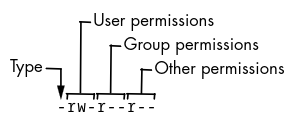
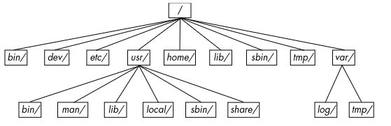

# Basic Command And Directory Hierarchy

This section will cover the Unix commands and utilities you'll frequently encounter. You might ask why Unix commands? This is because Linux is a Unix flavor at heart, and you can use all these commands on BSD and other Unix-flavored systems. Knowing these commands can also boost your understanding of the kernel as many correspond directly to system calls. 

## 2.1 The Bourne Shell: /bin/sh
A *shell* is a program that runs commands like the ones users enter into a terminal window. These commands can be other programs or built-in features of the shell.

There are many different Unix shells, but all derive features from the Bourne shell(*/bin/sh*), a standard shell developed at Bell Labs for early versions of Unix. Linux uses an enhanced version of the Bourne shell called `bash` or the "Bourne-again" shell. The `bash` shell is the default on most Linux distributions, and */bin/sh* is normally a link to `bash` on a Linux system.

> **_NOTE:_** You can change your shell with the `chsh` command

## 2.2 Using the Shell
When installing Linux you should create at least one regular user to be your personal account.

### 2.2.1 The Shell Window
The easiest way to open up a shell window is to open a terminal application which starts a shell inside a  new window. It should display a prompt at the top that usually ends with a dollar sign($). The prompt should look something like `[name@host path]$` where *name* is your username, *host* is the name of your machine, and *path* is your current working directory. Enter the following command and press ENTER:

```Shell
$ echo Hello there.
```

Command usually begin with a program to run and may be followed by *arguments* that tell the program what to operate on and how to do so. Many arguments are options that modify the default behavior of a program and typically begin with a dash(-).

### 2.2.2 cat
The `cat` program simply outputs the contents of one or more files or another source of input. The general syntax is as follows:

```Shell
$ cat file1 file2 ...
```

### 2.2.3 Standard Input and Standard Output
Unix processes use I/O *streams* to read and write data. Streams are very flexible, for example, the source of an input stream can be a file, a device, a terminal window, or even the output stream from another process.

To see an input stream at work, enter `cat`(with no arguments) and press ENTER. This time you won't get any immediate output and you won't get your shell prompt back because `cat` is still running. Now if you type anything and press ENTER `cat` will repeat what you typed. Press CTRL-D on an empty line to terminate `cat` and return to the shell prompt.

The reason `cat` adopts an interactive behavior here has to do with streams. When you don't specify an input filename `cat` reads from the *standard input* stream provided by the Linux kernel rather than a stream connected to a file. In this case, the standard input is connected to the terminal where you run `cat`.

> **_NOTE:_** Pressing CTRL-D on an empty line stops the current standard input entry from the terminal with an EOF(end-of-file) message(and often terminates a program). This is different from CTRL-C, which usually terminates a program regardless of its input or output.

*Standard output* is similar, the kernel gives each process a standard output stream where it can write its output. The `cat` command always writes its output to the standard output which was your terminal in this case.

Standard input and output are often abbreviated as *stdin* and *stdout*. Many commands operate similar to `cat`, if you don't specify an input file, the commands read from stdin. Output is a little different. Some programs(like `cat`) send output only to stdout, but others have the option to send output directly to files.

## 2.3 Basic Commands
Most of the following programs take multiple arguments, and some have loads of options and formats, too many to cover here but we'll go over the basics.

### 2.3.1 ls
The `ls` command lists the contents of a directory. The default is the current directory but you can add any directory or file as an argument. It also has many useful options like `ls -l` for a detailed listing and `ls -f` to display file type information.

```Shell
$ ls -l 
total 4
drwxr-xr-x. 1 siddharth siddharth   6 May  4 08:57 aws_certs
drwxr-xr-x. 1 siddharth siddharth 438 May  4 08:57 git
drwxr-xr-x. 1 siddharth siddharth  22 May  4 08:57 Go
drwxr-xr-x. 1 siddharth siddharth  52 May  4 08:57 Linux
-rw-r--r--. 1 siddharth siddharth   8 May  4 08:57 README.md
drwxr-xr-x. 1 siddharth siddharth  16 May  4 08:57 Rust
```

### 2.3.2 cp
In its simplest form, `cp` copies files, for example to copy *file1* to *file2*:
```Shell
$ cp file1 file2
```
You can also copy a file to another directory, keeping the same file name in that directory: 
```Shell
$ cp file1 dir
```
To copy more than one file to a directory named *dir*:
```Shell
$ cp file1 file2 file3 dir
```

### 2.3.3 mv
The `mv`(move) command works much like `cp`. In its simplest form it renames a file.
```Shell
$ mv file1 file2
```
You can also use `mv` to move files to other directories the same way as `cp`.

### 2.3.4 touch
The `touch` command can create a file. If the target file already exists, `touch` doesn't change the file, but it does update the file's modification timestamp.
```Shell
$ touch file
```

### 2.3.5 rm
The `rm` command deletes(removes) a file. After you remove a file, it's usually gone from your system and generally cannot be undeleted unless you restore it from a backup.
```Shell
$ rm file
```

### 2.3.6 echo
The `echo` command prints its arguments to the standard output:
```Shell
$ echo Hello again.
Hello again.
```
The `echo` command very useful for finding expressions of shell globs(wildcards such as `*`) and variables(such as `$HOME`) which we will see later in this section.

## 2.4 Navigating Directories
The Unix directory hierarchy starts at */* and is called the *root directory*. The directory separator is the slash(/). There are several standard subdirectories in the root directory like */usr* which we'll cover in [section 2.19](#219-linux-directory-hierarchy-essentials)

When you refer to a file or directory, you specify a *path* or *pathname*. When a path starts with */* it's a *full* or *absolute path*. A path component identified by two dots(..) specifies the parent of a directory and one dot(.) refers to the current directory. A path not beginning with */* is called a *relative path*.

### 2.4.1 cd
The *current working directory* is the directory that a process(such as the shell) is currently in. Each process can independently set its own current working directory, the `cd` command changes the shell's current working directory:
```Shell
$ cd dir
```

If you omit *dir*, the shell returns to your *home directory*, the directory where you started when you first logged in, this is often abbreviated with the *~* symbol.

> **_NOTE:_** The `cd` command is a shell built-in. It wouldn't work as a separate program because if it were to run as a subprocess, it could not(normally) change its parent's current working directory.

### 2.4.2 mkdir
The `mkdir` command creates a new directory *dir*:
```Shell
$ mkdir dir
```

### 2.4.3 rmdir
The `rmdir` command removes the directory *dir*:
```Shell
$ rmdir dir
```

If *dir* isn't empty, this command fails. To quickly delete a non-empty directly instead use `rm -r dir`, this will delete the directory and all its contents. Be careful when using this command as it can do serious damage especially if run as the superuser. The `-r` option specifies *recursive delete*, always double check your command before you run it.

### 2.4.4 Shell Globbing ("Wildcards")
The shell can match simple patterns to file and directory names, a process known as *globbing*. The simplest of these is the glob character(*), which tells the shell to match any number of arbitrary characters. The following prints a list of all the files in the current directory:
```Shell
$ echo *
```

The shell matches arguments containing globs to filenames, substitutes those filenames for those arguments, and then runs the revised command. This substitution is called *expansion*, here are some examples:
- *at\** expands to all filenames that start with *at*
- *\*at* expands to all filenames that end with *at*
- *\*at\** expands to all filenames that contain *at*

If no files match a glob, the `bash` shell performs no expansion, and the command runs with the literal characters.

Another shell glob character, the question mark(?), instructs the shell to match exactly one arbitrary character. For example, *b?at* matches *boat* and *brat*.

If you don't want the shell to expand a glob in a command enclose the glob in single quotes(''). For example, the command `echo '*'` prints a star.

There is more to the shell's patter-matching capabilities, but *\** and *?* are the basics you need to know.

## 2.5 Intermediate Commands
This section covers the most essential intermediate Unix commands.

### 2.5.1 grep
The `grep` command prints the lines from a file or input stream that match an expression. For example, to print the lines in the */etc/passwd* file that contains the text *root* use this:
```Shell
$ grep root /etc/passwd
root:x:0:0:root:/root:/bin/bash
operator:x:11:0:operator:/root:/sbin/nologin
```

Two of the most important `grep` options are `-i`(for case-insensitive matches) and `-v`(which inverts the search and prints all lines that *don't* match)

`grep` understands *regular expressions*, which are more powerful that wildcard-style patterns, and have a different syntax.

> **_NOTE:_** To learn more you can read Mastering Regular Expressions, 3rd edition, by Jeffery E. F. Friedl or other online documentation on regular expressions.

### 2.5.2 less
The `less` command comes in handy when a file is really big or when a command's output is long and scrolls off the top of the screen. To page through a big file like */usr/share/dict/words* use `less /usr/share/dict/words`. When running `less` you'll see the contents of the file one screenful at a time. Press the spacebar to go forward in the file and press b(lowercase) to skip back one screenful, and press q to quit.

> **_NOTE:_** The `less` command is an enhanced version of an older program named `more`. Linux desktops and servers have `less` but it's not standard on many embedded systems and other Unix systems. If you can't run `less` try `more`.

You can also search for text inside `less`. To search forward you can type */word* and to search backward you can use *?word*. When you find a match press n to jump to the next matching occurrence of the word.

We'll see in [section 2.14](#214-shell-input-and-output) that you can send the standard output of nearly any program directly to another program's standard input. This is very useful when you have a command with a lot of output to sift through, here's an example:
```Shell
$ grep ie /usr/share/dict/words | less
```

### 2.5.3 pwd
The `pwd`(print working directory) command simply outputs the name of the current working directory. This might not seem necessary since most Linux distributions have user accounts with the current working directory in the prompt, but there are two reasons why it is needed. First, not all prompts include the current working directory. Second, symbolic links, which we'll cover in [section 2.17.2](#2172-working-with-symbolic-links) can sometime obscure the true full path of the current working directory. We can use `pwd -P` to remove this confusion.

### 2.5.4 diff
To see the differences between two text files use `diff`:
```Shell
$ diff file1 file2
```

There are several options to control the format of the output, though the default is often the most comprehensible for humans. However, most programmers use `diff -u` when sending the output to others as automated tools have an easier time with this format

### 2.5.5 file
If you see a file and are unsure of its format, try using the `file` command to see if the system can guess it:
```Shell
$ file file_name
```

### 2.5.6 find and locate
It can be frustrating when you know that a certain file is in a directory tree but you don't know exactly where. Run `find` to find *file* in *dir* as follows:
```Shell
$ find dir -name file -print
```

Most systems also have a `locate` command for finding files. Rather than searching for a file in real time, `locate` searches an index that the system builds periodically. Searching with `locate` is much faster than `find`, but if the file you're looking for is newer than the index, `locate` won't find it.

### 2.5.7 head and tail
The `head` and `tail` commands allow you to quickly view a portion of a file or stream of data. For example, `head /etc/passwd` shows the first 10 lines of the password file and `tail /etc/passwd` shows the last 10 lines. To change the number of lines to display use the `-n` option, where *n* is the number of lines you want to see(`head -5 /etc/passwd`).

### 2.5.8 sort
The `sort` command quickly puts the lines of a text file in alphanumeric order. If the file's lines start with numbers and you want to sort in numerical order, use the `-n` option. The `-r` option reverse the order of the sort.

## 2.6 Changing Your Password and Shell
Use the `passwd` command to change your password. You'll be prompted for your old password and then prompted for your new password twice. The best passwords tends to be long "nonsense" sentences that are easy to remember, try to aim for 16 characters or more.

You can change your shell with the `chsh` command(some other shells are `zsh`, `ksh`, or `tcsh`), but keep in mind these notes all assume the use of `bash` and some of the examples may not work with other shells.

## 2.7 Dot Files
Dot files are configuration files and directories whose names begin with a dot(.), and are hidden so if you run just `ls` you won't see them listed. To list them use `ls -a`. Some common dot files are *.bashrc* and *.gitconfig*, there are also dot directories such as *.ssh*.

There's nothing special about dot files or directories other than some programs don't show them by default in order to reduce clutter. Additionally, shell globs don't match dot files unless you explicitly use a patter such as `.*`.

## 2.8 Environment and Shell Variables 
The shell can store temporary variables, called *shell variables*, containing the values of text strings. They are useful for keeping track of values in scripts, and some shell variables control the way the shell behaves(For example, the `bash` shell reads the `PS1` variable before displaying the prompt). 

To assign a value to a shell variable, use the equal sing(=) like below:
```Shell
$ STUFF=blah
```

The preceding example sets the value of the variable named `STUFF` to `blah`. To access this variable, use `$STUFF`(for example, try `echo $STUFF`). We'll cover the many uses of shell variables in [section 11](./11_introduction_to_shell_scripts.md)

> **+_NOTE:_** Don't put any spaces around the `=` when assigning a variable.

An *environment variable* is like a shell variable but it's not specific to the shell. All processes on Unix systems have environment variable storage. The main difference between environment and shell variables is that the operating system passes all of your shell's environment variables to programs that the shell runs, whereas shell variables cannot be accessed in commands that you run.

You assign an environment variable with the shell's `export` command like so:
```Shell
$ STUFF=blah
$ export STUFF
```

Because child processes inherit environment variables from their parent, many programs read them for configuration and options. For example, you can put your favorite `less` command-line options in the `LESS` environment variable, and `less` will use those options when you run it.(Many manual pages contain a section labeled ENVIRONMENT that describes these variables.)

## 2.9 The Command Path
`PATH` is a special environment variable that contains the *command path* or just *path* for short. It is a list of system directories that the shell searches when trying to locate a command. For example, when you run `ls`, the shell searches the directories listed in `PATH` for the `ls` program. If programs with the same name appear in several directories in the path, the shell runs the first matching program.

If your run `echo $PATH`, you'll see the path components are separated by colons(:).
```Shell
$ echo $PATH
/home/siddharth/.cargo/bin:/home/siddharth/.local/bin:/home/siddharth/bin:/usr/local/bin:/usr/local/sbin:/usr/bin:/usr/sbin:/usr/local/go/bin:/usr/local/go/bin:/home/siddharth/.local/share/nvim/mason/bin:/usr/local/go/bin
```

You can tell the shell to look in more places for programs by changing the `PATH` variable like so:
```Shell
$ PATH=$PATH:dir
```

> **_NOTE:_** You can accidentally wipe out your entire path if you mistype `$PATH` when modifying your path. However this damage isn't permanent as you can just start a new shell. To create lasting effects you need to mistype when editing certain configuration files and even then it still isn't too difficult to rectify.

## 2.10 Special Characters
When discussing Linux with others, you should know some of the common names for special characters that you will encounter.

| Characters  | Name(s)   | Uses   |
|-------------- | -------------- | -------------- |
| * | star, asterisk  | Regular expression, glob character  |
| . | dot | Current directory, file/hostname delimiter |
| ! | bang | Negation, command history |
| \| | pipe | Command pipes |
| / | (forward)slash | Directory delimiter, search command |
| \ | backslash | Literals, macros (never directories) |
| $ | dollar | Variables, end of line |
| ' | tick, (single)quote | Literal strings |
| ` | backtick, backquote | Command substitution |
| " | double quote | Semi-literal strings |
| ^ | caret | Negation, beginning of line | 
| ~ | tilde, squiggle | Negation, directory shortcut |
| # | hash, sharp, pound | Comments, preprocessor, substitutions |
| [ ] | (square)brackets | Ranges |
| { } | brace, (curly)brackets | Statement blocks, ranges |
| _ | underscore, under | substitute for space used when spaces aren't wanted or allowed |

## 2.11 Command-Line Editing
As you work with the shell, notice that you can edit the command line using the left and right arrow keys, as well as page through previous commands using the up and down arrows. This is standard on most Linux systems. However, it's a good idea to get used to using control key combinations instead, below is a list of standard ones used in many Unix programs

| Keystroke   | Action    |
|--------------- | --------------- |
| CTRL-B | Move the cursor left | 
| CTRL-F | Move the cursor right |
| CTRL-P | View the previous command(or move the cursor up) |
| CTRL-N | View the next command(or move the cursor down) |
| CTRL-A | Move the cursor to the beginning of the line |
| CTRL-E | Move the cursor to the end of the line |
| CTRL-W | Erase the preceding word |
| CTRL-U | Erase from the cursor to the beginning of the line |
| CTRL-K | Erase from the cursor to the end of the line |
| CTRL-Y | Paste erased text(for example, from CTRL-U) |

## 2.12 Text Editors
Most parts of the system use plaintext configuration files and because you will be editing these files often you need a powerful tool for the job. You should try to learn one of the two de facto standard Unix text editors, vi and Emacs. Most Unix wizards are religious about their choice of editor but you should just choose whichever one works best for you. 

- If you want an editor that can do almost anything and has extensive online help, and you don't mind doing some extra typing to get these features, try Emacs.
- If speed is everything, give vi a shot.

You might be tempted to experiment with a friendlier editor when you first start out, such as nano, Pico, or one of many GUI editors out there, but if you tend to make a habit out of the first thing that you use, you don't want to go this route.

## 2.13 Getting Online Help
Linux systems come with a wealth of documentation. For basic commands, the manual pages(or *man pages*) will tell you what you need to know and you access them like this:
```Shell
$ man ls
```

To search for a manual page by keyword, use the `-k` option:
```Shell
$ man -k keyword
```

This is helpful when you don't quite know the name of the command that you want. For example if you're looking for a command to sort something you could run:
```Shell
$ man -k sort
--snip--
comm (1) - compare two sorted files line by line
qsort (3) - sorts an array
sort (1) - sort lines of text files
sortm (1) - sort messages
tsort (1) - perform topological sort
--snip--
```

The output includes the manual page name, the manual section, and a quick description of what the manual page contains. Manual pages are referenced by numbered sections, the table below lists the sections and their numbers:

| Section   | Descripton    |
|--------------- | --------------- |
| 1 | User Commands |
| 2 | Kernel system calls |
| 3 | Higher-level Unix programming library documentation |
| 4 | Device interface and driver information |
| 5 | File descriptions(system configuration files)|
| 6 | Games |
| 7 | File formats, conventions, and encodings(ASCII, suffixes, and so on)|
| 8 | System commands and servers |

The GNU project uses another format called *info*(or *textinfo*). Often this documentation goes further than a typical manual page does, but can be more complex. To access an info manual use the following:
```Shell
$ info command
```

Some packages dump their available documentation into */usr/share/doc* with no regard for manual systems such as `man` or `info`.

## 2.14 Shell Input and Output
To send the output of *command* to a file instead of the terminal use the `>` redirection character:
```Shell
$ command > file
```

The shell creates *file* if it does not exist, if it does exist the shell erases(*clobbers*) the original file first. To append the output to the file instead of overwriting it use the `>>` redirection syntax:
```Shell
$ command >> file
```

To send the standard output of a command to the standard input of another command use the pipe character(|) like so:
```Shell
$ head /proc/cpuinfo | tr a-z A-Z
```

You can send the output through as many piped commands as you wish, just add another before each additional command.

### 2.14.1 Standard Error
Occasionally, you may redirect standard output but find the program still prints something to the terminal. This is called *standard error*(stderr), it's an additional output stream for diagnostics and debugging. For example: 
```Shell
$ ls /aaaaaa > a
```

After completion, *a* should be empty but you will see the following error message in the terminal:
```Shell
ls: cannot access '/aaaaaa': No such file or directory
```

You can redirect the standard error as well using the `2>` syntax:
```Shell
$ ls /aaaaaa > a 2> e
```

The number 2 specifies the *stream ID* that the shell modifies. Stream ID 1 is the standard output(the default) and 2 is standard error. You can also send the stderr to the same place as stdout with the `>&` notation:
```Shell
$ ls /aaaaaa > a 2>&1
```

### 2.14.2 Standard Input Redirection
To channel a file to a program's standard input use the `<` operator:
```Shell
$ head < /proc/cpuinfo
```

You will occasionally run into a program that requires this type of redirection, but most Unix commands accept filenames as arguments, so this isn't very common. The above command could have simply be written as `head /proc/cpuinfo`.

## 2.15 Understanding Error Messages
When you encounter a problem on a Unix-like system like Linux, you *must* read the error message. Unlike messages from other operating systems, Unix errors usually tell you exactly what is wrong.

### 2.15.1 Anatomy of a Unix Error Message
Most Unix programs generate and report the same basic error messages, here is an example that you'll likely encounter in some form or another:
```Shell
$ ls /dsafsda
ls: cannot access /dsafsda: No such file or directory
```

There are three components to this message.
- The program name, `ls`. Some programs may omit this identifying information
- The filename, */dsafsda*, and there is a problem with this path.
- The error `No such file or directory` indicates the problem with the filename

This example is obvious, but these messages can get a little confusing when you run a shell script that includes an erroneous command under a different name.

When troubleshooting errors, always address the first error first. Some programs report that they can't do anything before reporting a host of other problems. For example, say you  run a fictitious program called `scumd` and you see this error message:
```Shell
scumd: cannot access /etc/scumd/config: No such fire or directory
```

Following this is a huge list of other error messages, don't let those other errors distract you. All you probably have to do is create */etc/scumd/config*.

> **_NOTE:_** Don't confuse error messages with warning messages. Warnings usually mean something is wrong but the program will try and continue running anyway. To fix a warning message, you may have to find a process and kill it before doing anything else.(We'll cover listing and killing processes in [section 2.16](#216-listing-and-manipulating-processes))

### 2.15.2 Common Errors
#### No such file or directory
This is the number one error. Because the Unix file I/O system doesn't discriminate much between files and directories, this error message covers both cases. This error is also known as ENOENT, short for "Error NO ENTity."

> **_NOTE:_** If you're interested in system calls, this is usually the result of `open()` returning ENOENT. See the open(2) manual page for more information on the errors it can encounter.

#### File exists
In this case, you probably tried to create a file that already exists. Common when you try to create a directory with the same name as a file.

#### Not a directory, Is a directory
These messages occur when you try to use a file as a directory, or a directory as a file.

#### No space left on device
You're out of disk space.

#### Permission denied
You get this when you attempt to read or write to a file or directory that you have insufficient privileges to access. Also occurs when you try to execute a file that does not have the execution bit set(even if you can read the file). We'll cover permissions in [section 2.17](#217-file-modes-and-permissions).

#### Operation not permitted
Usually happens when you try to kill a process that you don't own.

#### Segmentation fault, Bus error
A *segmentation fault* essentially means that the program tried to access a part of memory that it was not allowed to touch and the operating system killed it. Similarly, a *bus error* means that the program tried to access some memory in a way it shouldn't have. This could mean that you gave the program some input that it did not expect. In rare cases, it might be faulty memory hardware.

## 2.16 Listing and Manipulating Processes
Each process on the system has a numeric *process ID(PID)*. For a quick listing of running processes, just run the `ps` command:
```Shell
$ ps
PID   TTY STAT TIME COMMAND
520   p0  S    0:00 -bash
545   ?   S    3:59 /usr/X11R6/bin/ctwm -W
548   ?   S    0:10 xclock -geometry -0-0
2159  pd  SW   0:00 /usr/bin/vi lib/addresses
31956 p3  R    0:00 ps
```

The fields are as follow:
- **PID**: The process ID.
- **TTY**: The terminal device where the process is running. More on this later.
- **STAT**: The process status, meaning what it is doing and where its memory resides. For example, `S` means sleeping and `R` means running.(See the ps(1) manual page for a description of all the symbols)
- **TIME**: The amount of CPU time in minutes and seconds that the process has used so far.
- **COMMAND**: This one might seem obvious as the command used to run the program but a process can change this field from its original value. Also the shell can perform glob expansion, and this field will reflect the expanded command.

> **_NOTE:_** PIDs are unique for each process running on a system. Once a process terminates, the kernel can reuse the PID for a new process.

### 2.16.1 Command Options
The `ps` command has many options and they can be specified in three different styles-Unix, BSD, and GNU. Many prefer the BSD style, maybe because it involves less typing. Here are some examples:
- `ps x` Show all of your running processes
- `ps ax` Show all processes on the system, not just the ones that you own
- `ps u` Include more detailed information on processes
- `ps w` Show full command names not just what fits on one line

### 2.16.2 Process Termination
To terminate a process you send it a *signal*, a message to a process from the kernel, with the `kill` command:
```Shell
$ kill pid
```

There are many types of signals. The default is `TERM`, or terminate. You can send different signals by adding an extra option to `kill`. For example, to freeze a process instead of terminating it use `STOP`:
```Shell
$ kill -STOP pid
```

A stopped process is still in memory, read to pick up where it left off. Use the `CONT` signal to continue running the process again:
```Shell
$ kill -CONT pid
```

> **_NOTE:_** Using CTRL-C to terminate a process is the same as using `kill` with the `INT`(interrupt) signal.

The kernel gives most processes a chance to clean up after themselves upon receiving signals. However, some processes may choose a non-terminating action in response to a signal, get wedged in the act of trying to handle it, or simply ignore it, so you might find the process is still running after you try to terminate it. If this happens and you really need to kill the process you can use the `KILL` signal. Unlike other signals, `KILL` cannot be ignored. In fact the operating system doesn't give the process a chance, it simply terminates the process and forcibly removes it from memory. Only use this as a last resort especially if you are unsure what a process is doing.

### 2.16.3 Job Control
Shells support *job control*, which is a way to send `TSTP`(similar to `STOP`) and `CONT` signals to programs using various keystrokes and commands. For example, you can send a `TSTP` signal with CTRL-Z and start the process again using `fg`(bring to foreground) or `bg`(move to background;see the next [section](#2164-background-processes)).

> **_NOTE:_** To see if you've accidentally suspended any processes on your current terminal, run the `jobs` command.

### 2.16.4 Background Processes
Normally, when you run a Unix command from the shell, you don't get the shell prompt back until the program finishes executing. However, you can detach a process from the shell and put it in the "background" with the ampersand(&).
```Shell
$ gunzip file.gz &
```

The shell should respond by printing the PID of the new background process, and the prompt should return immediately. If the process takes a very long time, it can even continue to run after you log out. If the process finishes before you log out or close the terminal window, the shell usually notifies you depending on your setup.

> **_NOTE:_** If you're remotely accessing a machine and want to keep a program running when you log out you may need to use the `nohup` command.

Some processes may expect to work with standard input and if they are put in the background the may freeze or terminate. Also if a program writes to standard output or standard error, the output can appear in the terminal window with no regard for anything else running there. The best way to make sure this doesn't happen is to redirect its output as described in [section 2.14](#214-shell-input-and-output) .

## 2.17 File Modes and Permissions
Every Unix file has a set of *permissions* that determine whether you can read, write, or run the file. Running `ls -l` displays the permissions:
```Shell
-rw-r--r-- 1 juser somegroup 7041 Mar 26 19:34 endnotes.html
```

The file's *mode* represents the file's permissions and some extra information:


Each permission set(*user*, *group*, and *other*) can contain four basic representations:
- `r` means that the file is readable
- `w` means that the file is writable
- `x` means that the file is executable
- `-` means the permission for that slot in the set has not been granted

Some executable files have an `s` in the user permissions listing instead of an `x`. This indicates that the executable is *setuid*, meaning that when you execute the program it runs as though the file owner is the user instead of you. Many programs use this setuid bit to run as root in order to get the privileges they need to change system files. One example is the `passwd` program, which needs to chagne the `/etc/passwd` file.

### 2.17.1 Modifying Permissions
To change permissions on a file or directory use the `chmod` command. First pick the set of permissions that you want to change and then pick the bit to change. For example, to add group(g) and other(o) read permissions to *file* you could do the following:
```Shell
$ chmod g+r file
$ chmod o+r file
```

Or you could do it all in one command:
```Shell
$ chmod go+r file
```

To remove these permissions, use `go-r` instead of `go+r`

You can also change permissions with numbers:
```Shell
$ chmod 644 file
```

This is called *absolute* change because it sets *all* permission bits at once. The permissions are represented in octal form(each number represents a number in base 8, 0 through 7, and corresponds to a permission set). See the chmod(1) manual page for more info.

Directories also have permissions. You can list the contents of a directory if it's readable, but you can only access a file in a directory if the directory is executable. 

Finally, you can specify a set of default permissions with the `umask` shell command, which applies a predefined set of permissions to any new file you create. 

### 2.17.2 Working with Symbolic Links
A *symbolic link* is a file that points to another file or directory, effectively creating an alias. They offer quick access to obscure directory paths. This is what a long listing of a symbolic link looks like:
```Shell
lrwxrwxrwx 1 ruser users 11 Feb 27 13:52 somedir -> /home/origdir
```

If you try to access *somedir* the system gives you */hom/origdir* instead. Symbolic links are simply filenames that point to other names. Their names and the paths to which they point don't have to mean anything, in fact in the previous example, *home/origdir* doesn't need to exist. When this is the case accessing *somedir* returns an error reporting that *somedir* doesn't exist.

Another problem is that you can't identify the characteristics of a link target just by looking at the name of the link, you have to follow the link to see if it goes to a file or directory. Your system may also have links that point to other links, which are called *chained symbolic links* and can be a nuisance when you're trying to track them down. To create a symbolic link from *target* to *linkname*, use `ln -s`:
```Shell
$ ln -s target linkname
```

> **_NOTE:_** Don't forget the `-s` option when creating a symbolic link. Without it, `ln` creates a hard link, giving an additional real filename to a single file. Hard links point directly to the file data instead of to another filename as a symbolic link does.

While there are a number of pitfalls with symbolic links they outweighed by the power they provide in organizing files and ability to easily patch up small problems. A common use case is when a program expects to find a particular file or directory that already exists somewhere else on your system. Instead of making a copy or having to change the program(often may not be possible), you can just create a symbolic link from it to the actual file or directory.

## 2.18 Archiving and Compressing Files
`gzip` and `tar` are two common utilities for compressing and bundling files and directories.

### 2.18.1 gzip
The program `gzip`(GNU Zip) is one of the current standard Unix compression programs. A file that ends in *.gz* is a GNU Zip archive. Use `gunzip file.gz` to uncompress *file.gz* and remove the suffix. To compress the file again use `gzip file`.

### 2.18.2 tar
Unlike ZIP programs for other operating systems, `gzip` does not create archives of files(it doesn't pack multiple files and directories into a single file). To create an archive use `tar`:
```Shell
# tar cvf archive.tar file1 file2 ...
```

Archives created by `tar` usually have a *.tar* suffix(this is by convention and isn't required). The `c` flag activates *create mode*, `v` is used to enable verbose output so you can see the list of files as they are being added to the archive, and the `f` option is used to specify the name of the output file.

#### Unpacking .tar Files
To unpack a *.tar* file with `tar` use the `x` flag:
```Shell
$ tar xvf archive.tar
```

The `x` flag puts `tar` into *extract(unpack) mode*. You can extract individual parts of the archive by entering the exact names of the parts you want to extract at the end of the command line. 

> **_NOTE:_** When using extract mode, remember that `tar` does not remove the *archived.tar* file after extracting its contents.

#### Using Table-of-Contents Mode
Before unpacking it's usually a good idea to check the contents of a *.tar* file with the &table-of-contents mode* by using the `t` flag instead of the `x` flag. This mode verifies the archive's basic integrity and prints the names of all files inside.

When unpacking, consider using the `p` option to preserve permissions. This will override your `umask` and get the exact permissions specified in the archive. The `p` option is the default when you're working as the superuser.

> **_NOTE:_** Make sure you're waiting until the command terminates and you get your shell prompt back. Even if you only want to extract a small part of an archive, `tar` must run through the who thing without interruption because it sets the permissions only *after* checking the entire archive. 

### 2.18.3 Compressed Archives (.tar.gz)
Often you will find that archives are compressed with filenames ending in *.tar.gz*. To unpack a compressed archive you need to do the following:
```Shell
$ gunzip file.tar.gz
$ tar xvf file.tar
```

To create a compressed archive simple do the reverse: first run `tar` then `gzip`. While this is okay when you first start out there is a better way to go about doing this.

### 2.18.4 zcat
A better way to do the tasks in the previous section is to combine archival and compression functions with a pipeline. The following unpacks *file.tar.gz*
```Shell
$ zcat file.tar.gz | tar xvf - 
```

The `zcat` command is the same as `gunzip -dc`. The `-d` option decompresses and `-c` sends the results to standard output(in this case to the `tar` command).

Because it's so common to use `zact`, the version of `tar` that comes with Linux has a shortcut. You can use `z` as an option to automatically invoke `gzip` on the archive. This works both for extracting an archive(with the `x` or `t` modes in tar) and creating one(with `c`). The following can be used to verify a compressed archive:
```Shell
$ tar -ztvf file.tar.gz
```

> **_NOTE:_** A .tgz file is the same as a .tar.gz file. The suffix is meant to fit into FAT(MS-DOS-based) filesystems. 

### 2.18.5 Other Compression Utilities
Two more compression programs are `xz` and `bzip2`, whose compressed files end with *.xz* and *.bz2* respectively. They are marginally slower than `gzip` but often compact text files a little more. The decompressing programs to use are `unxz` and `bunzip2`, and the options are very similar to `gzip`.

## 2.19 Linux Directory Hierarchy Essentials
The details of the Linux directory structure are outline in the Filesystems Hierarchy Standard, or [FHS](https://refspecs.linuxfoundation.org/fhs.shtml). The diagram below is a simplied overview of the hierarchy, showing some of the directories under */*, */usr*, and */var*. Notice that some of the directory structure under */ur* contains some of the same directory names as */*.



Here are some of the most important subdirectories under root:
- ***/bin*** Contains ready-to-run programs(executables) including most of the basic Unix commands such as `ls` and `cp`. Most of the programs in */bin* are in binary format, having been created by a C compiler, but some are shell scripts.

- ***/dev*** Contains device files, more about these in [section 3](./3_devices.md)

- ***/etc*** This core system directory contains the user password, boot, device, networking, and other setup files.

- ***/home*** Holds home(personal) directories for regular users. 

- ***/lib*** An abbreviation for library, this directory holds library files containing code that executables can use. There are two types of libraries, static and shared. The */lib* directory should contain only shared libraries, but other lib directories, such as */usr/lib*, contain both varieties as well as other files.(We'll cover shared libraries in more detail in [section 15](./15_development_tools.md))

- ***/proc*** Provides information about the running system, hardware, processes, and kernel configuration.

- ***/run*** Provides a location for applications and system services to store runtime data during the system's uptime. It is meant to hold data that is volatile and needs to be available across reboots or system restarts. 

- ***/sys*** Provides an interface to access and manipulate kernel and device information. It exposes various aspects of the system's hardware configuration and allows for dynamic interaction with system devices.  

- ***/sbin*** A place for system executables. Program in */sbin* relate to system management, so regular users usually do not have */sbin* components in their command paths. Many of the utilities found here do not work if not run as root. 

- ***/tmp*** A storage area for smaller, temporary files. Any user may read to and write from */tmp* but the user may not have permission to access another user's files there. Most distributions clear */tmp* when the machine boots and some even remove old files periodically.

- ***/usr*** It contains a large directory hierarchy, including the bulk of the Linux system. Many of the directory names in */usr* are the same as those in the root directory(like */usr/bin* and */usr/lib*), and they hold the same types of files. Overall it serves as a location for installed software, libraries, documentation, and user-specific resources on Linux systems.

- ***/var*** The variable subdirectory, where programs record information that can change over the course of time. System logging, user tracking, caches, and other files that system programs create and manage are here. 

### 2.19.1 Other Root Subdirectories
- ***/boot*** Contains kernel boot loader files. These files pertain only to the very first stage of the Linux startup procedure so there isn't information on how Linux starts up its services in this directory.(See [section 5](/Linux/How_Linux_Works-Brian_Ward/5_how_the_linux_kernel_boots.md) for information about that)

- ***/media*** A base attachment point for removable media such as flash drives.

- ***/opt*** This may contain additional third-party software. Many systems don't use */opt*.

### 2.19.2 The /usr Directory
*/usr*  is where most of the user-space programs and data reside. 

- ***/usr/bin*** Holds executables for user-level applications and commands that are not essential for basic system functionality. These binaries are typically accessible to all users.

- ***/usr/lib*** Contians libraries and additional data files for user applications and software packages. These libaries are not critical for the basic operation of the system, but are essential for various applications and services installed on the system. 

- ***/usr/include*** Stores header files that are needed for software development. Header files define the interfaces and structures used by programming languages and libraries.

- ***/usr/local*** Serves as a location for locally installed software and files that are specific to the local system. It provides a separate directory hierarchy from the system-provided files in */usr*, allowing users and system administrators to install and manage software that is not part of the core distribution. 

- ***/usr/share*** Contains files that should work on other kinds of Unix machines with no loss of functionality. These are usually shared by various applications and packages and includes things like icons, images, documentation, and default configurations for software. 

### 2.19.3 Kernel Location
On Linux systems, the kernel is normally a binary file */vmlinuz* or */boot/vmlinuz*. A *boot loader* loads this file into memory and sets it in motion when the system boots. 

Once the boot loader starts the kernel, the main kernel file is no longer used by the running system. However, you'll find many modules that the kernel loads and unloads on demand during the course of normal system operation. Called *loadable kernel modules*, they are located under */lib/modules*.

## 2.20 Running Commands as the Superuser
To run commands as the superuser you might be tempted to start a root shell, but doing so has many disadvantages:
- You have no record of system-altering commands.
- You have no record of the users who permored system-altering commands.
- You don't have access to your normal shell environment.
- You ahve to enter the root passowrd(if you have one).

### 2.20.1 sudo
Most distributions use a package called `sudo` to allow administrators to run commands as root while logged in as themselves. For example, you could do something like this:
```Shell
$ sudo vipw
```

When you run this command, `sudo` logs this action with the syslog service. We'll cover more about system logs in [seciton 7](/Linux/How_Linux_Works-Brian_Ward/7_system_configuration-logging_system-time_batch-jobs_and_users.md).

### 2.20.2 /etc/sudoers
To be able to run commands as the super user you must configure the privileged users in the */etc/sudoers* file. For example, to give *user1* and *user2* the pwoer to run any command as root without having to enter a password:
```
User_Alias ADMINS = user1, user2

ADMINS ALL = NOPASSWD: ALL

root ALL=(ALL) ALL
```

### 2.20.3 sudo Logs
You can find the `sudo` logs on most systems with this command:
```Shell
$ journalctl SYSLOG_IDENTIFIER=sudo
```

On older systems, you'll need to look for a logfile in */var/log*, such as */var/log/auth.log*.

## 2.21 Looking Forward
In the next few sections we'll be working with both kernel and user-space system components using the command line tools covered in this chapter.

