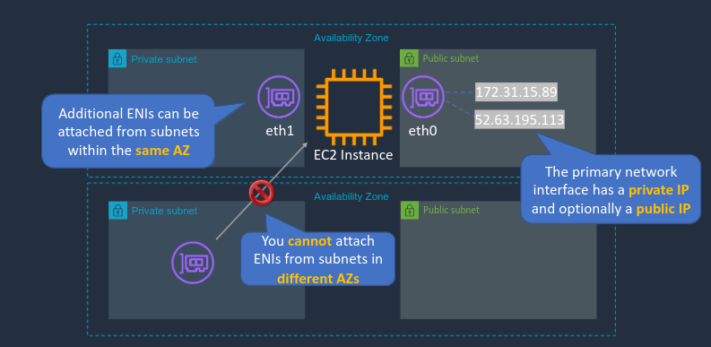

# Amazon Elastic Compute Cloud(EC2)
One of the original and most important services on AWS. It enables the running of virtual servers in the cloud. It's also used by many other services in AWS so it's very important to have a solid understanding of it before moving on.

Within an AWS data center there are host servers on which we can run EC2 instances using server virtualization. The EC2 hosts are managed by AWS and users manage the EC2 instance that is run on top of the host servers.

When launching instances we have to choose an instance type(hardware profile), which designates different combinations of CPU, memory, storage, and networking. This determines both the cost and the performance capabilities of that instance. Afterwards we select an Amazon Machine Image(AMI) which is essentially an image that contains the operating system and any configuration settings. AMIs are created from EBS Snapshots, which are point in time backups of an instance. 

### Benefits of EC2
- Elastic computing: easily launch hundreds or thousands of instances within minutes
- Complete control: administrative access to all instances
- Flexible: choice of instance types, operating systems, and software packages
- Reliable: Offers very high levels of availability and instances can be rapidly commissioned and replaced
- Secure: Fully integrated with Amazon VPC and other security features
- Inexpensive: (Relatively)Low cost, pay for what you use

## Amazon EC2 Instance in a Public Subnet


Within a region we have a virtual private cloud(VPC) within which we have our resources. Resources within the VPC are private but accessibility can be public. VPCs contain multiple Availability Zones(AZ) and within an AZ we have public and private subnets. Public subnets can receive connections from the internet.

Each instance has a hard drive, in this case a virtual hard drive, known as an Elastic Block Store(EBS) Volume where the data is stored. We also have a security group which determines which ports, protocols, and IP addresses we can connect from. This functions as a firewall securing access to our instances. Security groups can be used to control both inbound and outbound traffic.

We also need an Internet Gateway, this is attached to a VPC and enables access to and from the internet. When we want to connect to our EC2 instance we actually connect to the Internet Gateway and from there to the EC2 instance. 

## EC2 User Data
User data is code that runs when the instance starts up for the first time. The following is an example that installs a web server on our instance:

```Shell
#!/bin/bash
yum update -y
yum install -y httpd
systemctl start httpd
systemctl enable httpd
```

User data is limited to 16KB and can be uploaded either as text or as a file.

## EC2 Metadata
This is information available about a particular EC2 instance and it is available at the following address: http://169.254.169.254/latest/meta-data. This is a local address on your EC2 instance which you can use to find a variety of information about the instance itself. Here's an example:

```Shell
[ec2-user@ip-172-31-42-248 ~]$ curl http://169.254.169.254/latest/meta-data
ami-id
ami-launch-index
ami-manifest-path
block-device-mapping/
events/
hibernation/
hostname
indentity-credentials/
instance-action
instance-id
instance-life-cycle
instance-type
local-hostname
local-ipv4
```

## Accessing Services - Access Keys and IAM Roles
There will often be occasions where EC2 instances need to connect to other services. For instance, saving data to a storage service or database. There are few ways to do this, the first being access keys. 

Access keys are stored on the instance itself and are associated with a user account that has a permissions policy. This gives the instance access to whatever operations are allowed by that permissions policy. The downside to this approach is that access keys are stored on the file system of the instance which isn't very secure.

A better way to do this is to use an IAM role. We can use an instance profile to connect an IAM role to an EC2 instance. The instance will gain access to whatever permissions are associated with the role provides. The great thing about this is that no credentials are stored on the EC2 instance. 

## EC2 Placement Groups
EC2 placement groups are a way to control how and where AWS deploys EC2 instances within and across AZs. 

### Cluster
This packs instances closely together inside an AZ. This enables workloads to achieve low latency network performance and high throughput for inter-node communication which is often required for High Performance Computing(HPC) applications.

### Partition
This spreads your instances across logical partitions such that groups of instances in different partitions don't share underlying hardware. This is typically used for large distributed and replicated workloads such as Hadoop, Cassandra, and Kafka.

### Spread
This strictly places a small group of instances across distinct underlying hardware to reduce correlated failures.

## Network Interfaces(ENI, ENA, EFA)


When EC2 instances are launched a subnet is chosen, an interface is then attached to that subnet. The actual instance itself isn't in the subnet it is within the AZ, this means it can be attached to multiple subnets through different adapters. In the above example the instance has an eth0 adapter in a public subnet with both a public and private IP address, and an eth1 adapter in a private subnet within the same AZ. It is not possible to attach an adapter from a subnet in a different AZ. 

### Elastic network interface(ENI)
- ENI is the basic adapter for when there are no specific high-performance requirements 
- Can be used with all instance types

### Elastic Network Adapter(ENA)
- ENA provides enhanced networking performance and provides much higher bandwidth and lower inter-instance latency
- It can only be used with supported instance types

### Elastic Fabric Adapter(EFA)
- EFA are used for HPC and ML use cases
- Tightly coupled applications
- Can be used with all instance types

## Public, Private and Elastic IP(EIP) Addresses
Public IP addresses are dynamic addresses, meaning they might change. When you stop your instance and start it back up again it will pick up a new IPv4 public address, the private address will stay the same. This means you should not use the public IP address in application code because it can change over time. 

An Elastic IP is also a public IP but it's a static address and doesn't change and we can associate an Elastic IP with a network interface.

In the event that an instance fails and we have applications that are pointing to it's IP address we will want to is assign that IP address to another instance. To do this we have a two options. We can move the network interface and assign it to another instance within the same AZ. Another option is to move the Elastic IP address to a new instance with its own network interface. This allows you to fail over into a different AZ since the Elastic IP address can be remapped across AZs but the network interfaces cannot. 

Also note that EIP addresses that are allocated to your account but unused will incur charges.

## Network Address Translation(NAT) for Public Addresses
Let's take an example of an EC2 instance with a network interface with a private and public IP. If you were to run a command like `ip addr show eth0` from the command line of the instance you would only see the private IP. The instance doesn't know anything about the public IP and the reason for that is because the public IP is associated with the private IP externally. This associated is done by the Internet Gateway which performs 1:1 NAT. 

## Private Subnets and Bastion Hosts


In the above example we have a region, a VPC within that region, an AZ, and some public and private subnets. The public subnet has a route table associated with it. The first address is the CIDR block for the overall VPC, meaning that any destination within this address block will be routed locally using the VPC router. The second rule means any other address will be routed using the internet gateway. 

The private subnet has a separate route table and the key difference is that it doesn't have a route to the internet. You cannot attach an internet gateway to a private subnet, and instances within the private subnet do not have public IPs. Communication between public and private subnets can still occur but there is no outside access.

To connect from the outside world to an instance in a private subnet we could first connect to an instance in a public subnet, this is sometime referred to as a bastion host or a jump host, and from there connect to the instance in the private subnet using the VPC router. 

## NAT Gateways and NAT Instances
NAT Gateways and NAT Instances are both used to enable instances deployed in private subnets to connect to the internet. This is outbound only, if we wanted bidirectional traffic we would just deploy our instances into a public subnet.


A NAT gateway is deployed in a public subnet, it will have a private IP and an EIP which it uses to communicate with the internet gateway on behalf of the private instances. The route table for the private subnet now has a route pointing to the NAT gateway. Just like with the internet gateway route in the public route table it is for 0.0.0.0/0. With this configuration our private subnet instances can now use its private IP address to connect to the private IP address of the NAT gateway which can then forward the traffic to the internet gateway.NAT gateways are an AWS service that you can deploy.

NAT instances are a lot less popular now with the introduction of the NAT gateway. It is not an AWS service, it is just an specially configured EC2 instance which can be deployed using an AMI with "amzn-ami-vpc-nat" in its name. You must also disable source/destination checks in order to allow the NAT instance to function as a network address translator. 

## EC2 Instance Lifecycle


### Stopping EC2 Instances
- Only available for EBS backed instances
- No charge for stopped instances
- EBS volumes remain attached(chargeable)
- Data in RAM is lost
- Instance is typically migrated to a different host
- Private IPv4 addresses and IPv6 addresses retained, public IPv4 addresses released
- Associated EIPs are retained

### Hibernating EC2 Instances
- Available to on-demand or reserved Linux instances
- Contents of RAM saved to EBS volume
- Must be enabled for hibernation when launched
- When started(after hibernation):
  - The EBS root volume is restored to its previous state
  - The RAM contents are reloaded into memory
  - The processes that were previously running on the instance are resumed
  - Previously attached data values are reattached and the instance retains its instance ID

### Rebooting EC2 Instances
- Equivalent to an OS reboot
- DNS name and all IPv4 and IPv6 addresses are retained
- Does not affect billing

### Terminating EC2 Instances
- Cannot recover a terminated instance
- By default root EBS volumes are deleted
  - Additional volumes added are not deleted by default

### Recovering EC2 Instances
- CloudWatch can be used to monitor system status checks and recover instances if needed
- Applies if the instance becomes impaired due to underlying hardware or platform issues
- Recovered instance is identical to original instance

## AWS Nitro System
Nitro is the underlying platform for the next generation of EC2 instances. It's been around for a few years but it is evolving and more and more instance types are being supported on the nitro system, that includes both virtualized and bare metal instances.

The functions of the underlying infrastructure, including the hypervisor, are broken up into separate hardware modules. This includes:
- Nitro cards for VPC
- Nitro cards for EBS
- Nitro for Instance Storage
- Nitro security chip
- Nitro hypervisor
- Nitro Enclaves

The key benefits of the Nitro system are improved performance, security, and innovation. Performance is close to bare metal for virtualized instances. ENA and EFA are both based on the nitro system. They have higher network performance(e.g. 100Gbps), and are optimized for HPC workloads. There is also support for dense storage instances which go up to 60TB. 

### Nitro Enclaves
- These are isolated compute environments on hardened virtual machines 
- There is no persistent storage, interactive access, or external networking
- Uses cryptographic attestation to ensure only authorized code is running
- Integrates with AWS Key Management Service(KMS)
- Protect and securely process highly sensitive data:
  - Personally identifiable information
  - Healthcare data
  - Financial data
  - Intellectual Property data

## EC2 Pricing Options and Use Cases


### EC2 Billing
- There is per second billing with a minimum of 1 minute for Windows and Linux instances in On-Demand, Reserved, and Spot forms
- There is also hourly billing for Windows and commercial Linux distros like RHEL and SUSE
- EBS volumes are billed per second with a minimum of 1 minute

### EC2 Reserved Instances(RIs)
The term is either 1 or 3 years and there is both a standard RI and Convertible RI. The standard RI allows you to change AZs, instance size for Linux, and networking type. Convertible RI lets you change everything you could with standard RI but you can additionally change the instance family, OS, tenancy, and payment option. The payment option can be all upfront, partial upfront, or no upfront.

When the attributes of an instance you launch match the attributes of an RI the discount is applied. The attributes include the instance type, OS type, tenancy(default or dedicated), and the AZ and Region.

Scheduled RI is where you match the capacity reservation to a recurring schedule with a minimum of 1200 hrs per year. An example would be an application that runs 6 hours a day, 4 days a week = 1248 hours per year. This seems to be a deprecated functionality but still may appear on the exam.

### Savings Plans
There are two types of savings plans: compute savings and EC2 savings plan. With the compute savings plan it is an hourly commitment to usage of Fargate, Lambda, and EC2 with any region, family, size, tenancy, and OS. The EC2 savings plan is only for EC2 within a selected region and instance family, with any size, tenancy, and OS. Both plans are 1-3 year, hourly commitments.

### EC2 Spot Instances
- Spot Fleet: This launches and maintains the number of Spot/On-Demand instances to meet specified target capacity
- EC2 Fleet: Launches and maintains specified number of Spot/On-Demand/Reserved instances in a single API call
- There is a 2 minute warning if AWS need to reclaim capacity, this is available via instance metadata and CloudWatch Events
- Spot Block: No longer supported but it provided uninterrupted spot instances for 1-6 hrs at 30-45% discount 

## Cross-Zone Load Balancing
When cross-zone load balancing is enabled each load balancer node distributes traffic across the registered targets in all enabled AZs. When it is disabled each load balancer distributes traffic only across the registered targets in its AZ. ALBs have cross-zone load balancing always enabled while NLBs and GLBs have it disabled by default. Cross zone load balancing enables you to better distribute traffic.

## Session State and Session Stickiness
When using ELBs the applications on the EC2 instances are stateless. Any persistent data that we need to store must be stored outside the EC2 instance. And if a user is redirected to a different instance they shouldn't have to re-authenticate. 

One technique to achieve this is to store session state data externally. Session data such as authentication details can be stored in a DynamoDB table or some other form of external storage. Then if a user is directed to a different instance that authentication information can be retrieved from the external storage so they don't have to log in again.

Another technique is called sticky sessions. When a user connects to an instance a cookie is generated which binds a client to that instance for the lifetime of the cookie. If the client connection gets dropped and they reconnect the cookie will tell the load balancer which instance to connect back to. In this case session state data like authentication details might be stored locally on the instance itself. If the instance fails then the user will be directed somewhere else and the session data will be lost. Sticky sessions can be used with an external store for more resiliency though there is some added latency with that approach.
