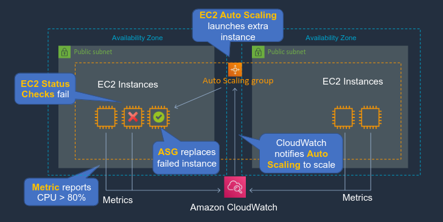
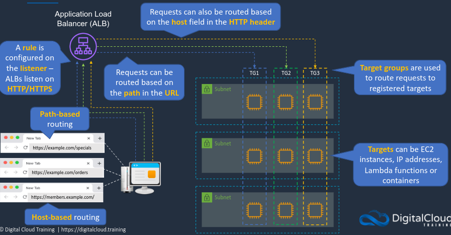
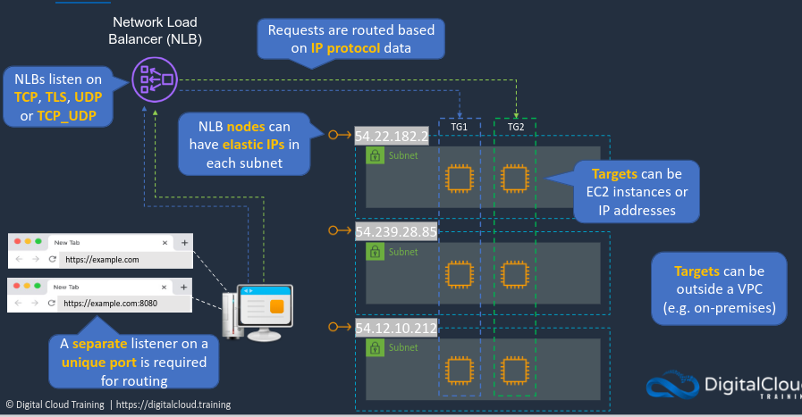

# Elastic Load Balancing, and Auto Scaling
Now that we are familiar with EC2 we need to understand how can we make sure that our applications have enough EC2 instances available and distribute incoming connections to those EC2 instances. Two technologies that really help with this are auto scaling and elastic load balancing, working together these two technologies enable elastic and fault tolerant applications.

## EC2 Auto Scaling

In the diagram above we have an auto scaling group(ASG). Within that group we have a few EC2 instances in public subnets and multiple AZs. When multiple AZs are specified for the ASG the service will generally try and spread the instances evenly across the AZs. 

There are different types of monitoring with EC2 instances. There are metrics being sent to CloudWatch and metrics from the instances themselves. Should an instance fail, the ASG will automatically replace that instance. 

In another scenario if the aggregate CPU utilization across our instances exceeds a certain percentage we can have a can have CloudWatch alarm notify the ASG to launch additional instances. With auto scaling we can respond dynamically to changes in events, scaling out and in as needed. Scaling policies define how to respond to changes in demand. 

### Configuration of an Auto Scaling Group
A Launch Template specifies the configuration of the instances that will be launched within the ASG, this includes things like the AMI, instance type, the volumes to be attached, what security groups to use, what key pair, etc.

Another option is to use a Launch Configuration but these have fewer attributes than, and are being replaced launch templates.

Once we have a launch template or launch configuration we start creating the ASG:
- Configure the purchase options: On-Demand vs Spot, etc.
- Configure the VPC and Subnets; not ASG do not span VPCs always within a single VPC
- Attach a load balancer
- Configure health checks(EC2 and ELB), EC2 checks enabled by default
- Group size and scaling policies

### Health Check Grace Period
- How long to wait before checking the health status of the instance
- Auto Scaling does not act on health checks until grace period expires

### Auto Scaling - Monitoring
#### Group Metrics(ASG)
- Data points about the ASG
- 1-minute granularity
- No charge
- Must be enabled

#### Basic monitoring(Instances)
- 5-minute granularity
- No charge

#### Detailed monitoring(Instances)
- 1-minute granularity
- Charges apply

### Additional Scaling Settings
**Cooldowns** - Used with simple scaling policy to prevent auto scaling from launching or terminating before effects of previous activities are visible. Default value is 5 minutes.

**Termination Policy** - Controls which instances to terminate first when a scale-in event occurs.

**Termination Protection** - Prevents Auto Scaling from terminating protected instances.

**Standby State** - Used to put an instance in the *InService* state into the *Standby* state, this gives an opportunity to update or troubleshoot the instance.

**Lifecycle Hooks** - Used to perform custom actions by pausing instances as the ASG launches or terminates them. These have a few potential use cases:
  - Run a script to download and install software after launching but you are unsure on the time needed so the health check grace period may not be enough. With lifecycle hooks you can pause the instance until they receive a confirmation from the script that the processes have completed.
  - Pause an instance to process data before a scale-in(termination)

## Types of Elastic Load Balancers
There are few different types of Elastic Load Balancers on AWS and it's important to know in which cases to use each one.

### Application Load Balancer(ALB)
- Operates at the request level(layer 7)
- Supports path-based routing, host-based routing, query string parameter-based routing, and source IP address-based routing
- Supports instances, IP addresses, Lambda functions and containers as targets

### Network Load Balancer(NLB)
- Operates at the connection level(layer 4)
- Routes connections based on IP protocol data
- Offers ultra high performance, low latency and TLS offloading at scale
- Can have a static IP/Elastic IP
- Supports UDP and static IP addresses as targets 

### Gateway Load Balancer(GLB)
- Used in front of virtual appliances such as firewalls, Intrusion Detection Systems(IDS)/Intrusion Prevention Systems(IPS), and deep packet inspection systems
- Operates at Layer 3 - listens for packets on all ports
- Forwards traffic to the Target Group(TG) specified in the listener rules
- Exchanges traffic with appliances using the GENEVE protocol on port 6081

## Routing with ALB and NLB

### ALB

### NLB

