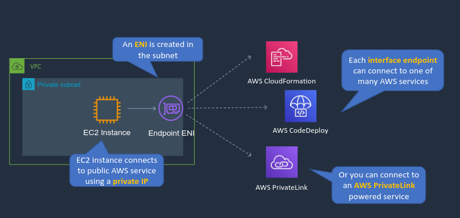

# Virtual Private Cloud(VPC)
A VPC is a logically isolated portion of the AWS cloud in which you can deploy your own AWS resources in a private space. This affords control over the networking environment, including the address ranges used, routing configuration, security groups for instances and firewalls for subnets. There are also various ways that you can connect to and from your VPCs and technologies to interconnect your various VPCs. 

## AWS Global Infrastructure

A **Region** is a physical location in the world that is independent and geographically distant from other regions. Within regions with have **Availability Zones**(AZ) which are composed of one or more data centers. AWS regions are connected via a high bandwidth, fully redundant network. Each region consists for two or more AZs, though some have as many as 6. **Local Zones** extend regions closer to end-users, this is mainly used to reduce latency. 

There may be situations where we want to extend some AWS services into an on-premises data center, this can be done using **AWS Outposts**. Outposts allow the operation of some AWS services on dedicated hardware within your own data center, this provides very low latency access to those services. 

**AWS Wavelength Zone** allows users to connect, with low latency, over 5G to services being run in the wavelength zone. Wavelength zones, outposts, and local zones are all connected to the AWS region.

### CloudFront Network

**Regional Edge Caches** and **Edge locations** are part of the CloudFront Network, which is Contend Delivery Network(CDN) service. This is used to get content closer to end users for better performance. 

## IPv4 Addressing Primer

### Structure of an IPv4 Address
IP addresses are written in dotted decimal notation `192.168.0.1`, each part of the address is a binary octet.

### Networks and Hosts
Every IP address has a network ID and a host ID. The network ID will be the same for every computer on a particular network, the host ID will be unique for each computer on the network. The way we know which portion is the network ID and which is the host ID is through a subnet mask. Every bit in the subnet mask that is 1 is a value that are used for the network id and every bit that is a 0 is used for a host id.

## VPC Overview
A VPC is a logically isolated portion of the AWS cloud within a region that you can deploy resource into. Subnets are created within AZs and you can have multiple subnets within the same AZ but they cannot span multiple AZs. The **VPC router** takes care of all routing for connections that go outside of a subnet and is configured using route tables. In order to connect to the internet we also need an internet gateway, this is attached to a VPC and you only ever have one per VPC. The internet gateway handles both ingress and egress traffic. 

You can create multiple VPCs per region, limited to 5 by default but you can request an increase if necessary. Each VPC has a CIDR block, the overall block of addresses from which you then create the addresses assigned to your subnets.

### VPC Core Knowledge
- A VPC is a virtual network dedicated to your AWS account
- Analogous to having your own data center inside AWS
- It is logically isolated from other virtual networks in the AWS Cloud
- Provides complete control over the virtual network environment including selection of IP ranges, creation of subnets, and configuration of route tables and gateways
- A VPC spans all AZs within a region
- When you create a VPC you must specify a range of IPv4 addresses for the VPC in the form of a CIDR block
- You have full control over who has access to the AWS resources inside your vpc
- A default VPC is created in each region with a public subnet in each AZ

## Defining VPC CIDR Blocks
- CIDR block size can be between /16 and /28
- The CIDR block must not overlap with any existing CIDR block that's associated with the VPC
- You cannot increase or decrease the size of an existing CIDR block
- The first four and last IP address are not available for use
- AWS recommend you use CIDR blocks from the RFC 1918 ranges:

| RFC 1918 ranges                                   | Example CIDR Block                                          |
|---------------------------------------------------|-------------------------------------------------------------|
| 10.0.0.0 - 10.255.255.255 (10/8 prefix)           | Your VPC must be /16 or smaller, for example, 10.0.0.0/16   |
| 172.16.0.0 - 172.31.255.255 (172.16/12 prefix)    | Your VPC must be /16 or smaller, for example, 172.31.0.0/16 |
| 192.168.0.0 - 192.168.255.255 (192.168/16 prefix) | Your VPC can be smaller, for example 192.168.0.0/20         |

### Additional Considerations
- Ensure you have enough networks and hosts
- Bigger CIDR blocks are typically better since they are more flexible
- Smaller subnets are OK for most use cases
- Consider deploying application tiers per subnet
- Split your HA resources across subnets in different AZs
- VPC Peering requires non-overlapping CIDR blocks, this is across all VPCs in all Regions/accounts you want to connect
- **Avoid overlapping CIDR blocks** as much as possible

## Security Groups and Network ACLs
**Network ACLs** are applied at the subnet level, and they are used to filer traffic entering and exiting a subnet. A **security group** is applied at the network interface level of EC2 instances. We can have the same security group applied to instances in different subnets.

Security groups support allow rules only, and there is essentially an implicit deny rule for anything that is not explicitly allowed. Network ACLs have both allow and deny rules. Rules are processed in order which means that once you reach a rule that either allows or denies processing stops there so the ordering of rules is very important. 

### Stateful vs Stateless Firewalls
A stateful firewall will allow return traffic automatically, this is what a security group is. A stateless firewall will check for an allow rule for both inbound and outbound connections, which is what a network ACL does.

### Security Group Best Practices

## VPC Peering
VPC peering allows for internal routing between addresses between VPCs, and by internally we mean it doesn't go out to the internet it uses the AWS global network to route traffic between VPCs. This traffic is encrypted when moving between regions and uses either private IPv4 or IPv6 addresses. 

When we want resources in different VPCs to communicate using VPC peering we can establish a VPC peering connection between our VPCs. This enables routing using private IPv4 and IPv6 addresses. The CIDR blocks for the VPCs must not overlap, which makes it very important to carefully consider what CIDR blocks you use for your VPCs.

The problem with VPC peering is that it doesn't support transitive peering. This means we need a dedicated peering connection from each VPC to every other VPC we want to connect to as show below:

As we increase the number of VPCs it can become unwieldy having a full mesh topology and there are other solutions that can be used instead.

To actually set up the peering connection we need to take care of two things. First we need to update our security groups to allow traffic from the CIDR block range of the other VPC. Then we have to update the route table with the CIDR block range of the other vpc as the destination mapped to the peering-id as the target. 

## VPC Endpoints
Some AWS services are private, meaning they run within a VPC like EC2, whereas other services are public because they have a public endpoint like S3. If we want to connect to S3 without using the public internet we can use VPC endpoints.

There are two types of VPC endpoints: There is a VPC interface endpoint and a VPC gateway endpoint. The gateway endpoint is one we can use for S3 and the interface one is slightly different and used for other services. We'll take a look at an interface endpoint example first.

### VPC Interface Endpoints

Here we have an Instance running in a private subnet and we don't want it's traffic routed to the public internet via a NAT gateway. So instead we provision an interface endpoint which creates an ENI in the subnet. The instance can then connect via the ENI to public services using private IP addresses. Each interface endpoint can connect to one of many AWS services. 

### VPC Gateway Endpoints

Here we provision on S3 gateway endpoint. This uses a route table entry to direct traffic to the gateway endpoint. The gateway endpoint can be secured using IAM policies and you can add bucket policies to only allow access to traffic coming from the gateway endpoint.

> **_NOTE:_** that gateway endpoints are limited to S3 and DynamoDB

### Service Provider Model

## AWS Client VPN
This is a way that you can connect your client computer to a VPC via a VPN connection. This allows you to communicate with resources in that VPC, for example connecting directly to a VPC using private IP addresses. Because it is a VPN it is encrypted end to end. Now let's look at how to set this up:

We create a VPN endpoint which is associated with client VPN network interfaces created in the subnets, this is the method with which the VPN connection is then able to communicate with resources in the subnets. The client computer will be running some VPN software, this is not AWS software, which will establish a connection with the VPN endpoint over SSL/TLS(port 443). The VPN endpoint will perform source network address translation from the CIDR block associated with the VPN client to the CIDR block associated with the VPC. 
