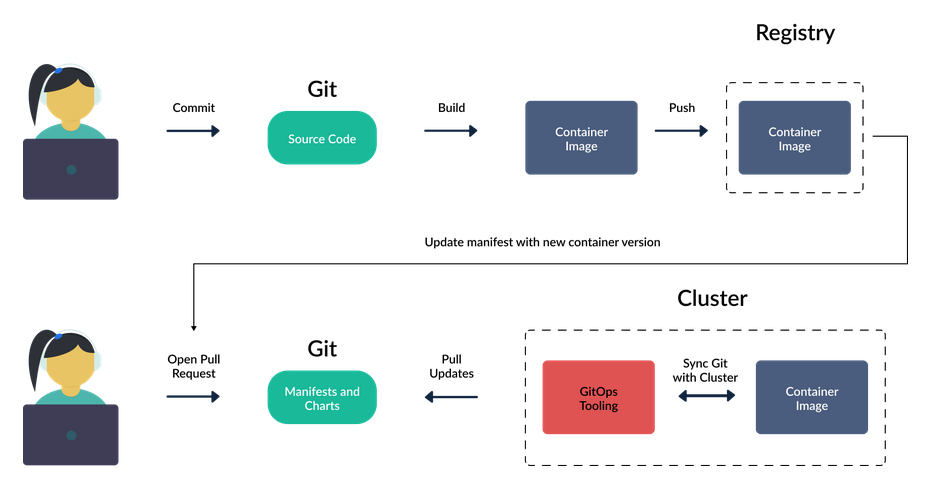

# GitOps Intro

<!--toc:start-->
- [GitOps Intro](#gitops-intro)
  - [What is GitOps](#what-is-gitops)
  - [GitOps Use Cases](#gitops-use-cases)
    - [Continuous deployment of applications](#continuous-deployment-of-applications)
    - [Continuous deployment of cluster resources](#continuous-deployment-of-cluster-resources)
    - [Continuous deployment of infrastructure](#continuous-deployment-of-infrastructure)
    - [Detecting/Avoiding configuration drift](#detectingavoiding-configuration-drift)
    - [Multi-cluster deployments](#multi-cluster-deployments)
  - [GitOps Pros and Cons](#gitops-pros-and-cons)
<!--toc:end-->

## What is GitOps
GitOps is a set of best practices where the entire code delivery process is controlled via Git, including infrastructure and application definitions as code and automation to complete updates and rollbacks.

**The Key GitOps Principles:**
- The entire system(infrastructure and applications) is described declaratively.
- The canonical desired system state is versioned in Git.
- Changes approved are automated and applied to the system.
- Software agents ensure correctness and alert on divergence

In the case of Kubernetes, GitOps deployments happen in the following manner:
1. A GitOps agent is deployed on the cluster.
2. The GitOps agent monitors one or more Git repositories that define and contain Kubernetes manifests
3. Once a Git commit happens the GitOps agent will instruct the cluster to reach the same state as what is described in Git.
4. Developers, operators, and other stakeholders perform all changes via Git and never directly touch the cluster.

## GitOps Use Cases

### Continuous deployment of applications
This is easiest if Kubernetes is already adopted and applications are handled in a declarative manner. This is also the most popular use of of GitOps and is applicable to most organizations. 

### Continuous deployment of cluster resources
After adopting GitOps for your own applications it makes sense to embrace the same principles for your supporting applications. These are applications you manage but don't necessarily develop. In the case of Kubernetes, these can be metrics applications, networking agents, service meshes, databases, etc. 

### Continuous deployment of infrastructure
If you have a way to define your infrastructure resources in a declarative manner(tools like Terraform) it should be very easy to adopt the GitOps principles for infrastructure that powers your applications. In the case of Kubernetes you can represent the cluster and associated services(e.g. registries) as declarative resources and manage them with GitOps.

### Detecting/Avoiding configuration drift
One of the most important parts of GitOps is the automatic reconciliation of what is described in Git versus what is described in the cluster. In most cases, this is how you should set up your GitOps agent, and any change in Git should be automatically transferred to the cluster.

They can also be used to detect changes in the cluster that were never described in Git. Ad-hoc changes on infrastructure are a well known problem and this configuration drift is one of the most common causes of failed deployments. The power to detect configuration drift early is one of the major differences between GitOps and traditional deployment solutions.

### Multi-cluster deployments
Deployments to multiple clusters at different geographical locations or with different configurations can be challenging and we need a way to track and understand what is in each deployment.

With GitOps, we have the state of all clusters stored in Git making it easy to know what is installed where, who installed it, and when just by looking at the Git history.

## GitOps Pros and Cons
GitOps is a better way to deliver software. While there are some cons, they are few when compared to the benefits:
- Faster deployments
- Safer deployments
- Easier rollbacks
- Straightforward auditing
- Better traceability
- Eliminating configuration drift

While the benefits are many following GitOps poses some challenges. Many teams will have to adjust their work practices to support using Git as the single source of truth and having all changes committed. This can present some challenges when it comes to debugging a live environment.

Some prerequisites for adopting GitOps include:
- Good testing and CI already in place
- A strategy for dealing with promotions between environments
- A way to manage secrets.
