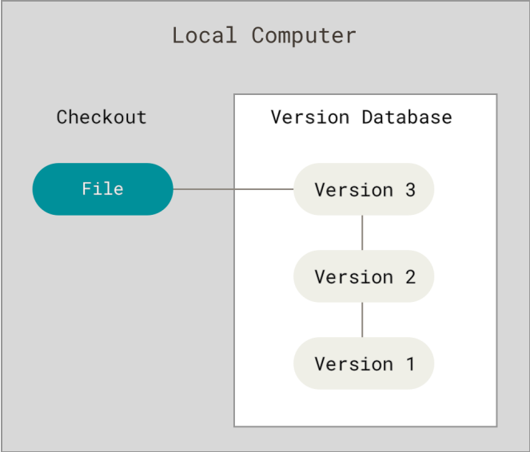
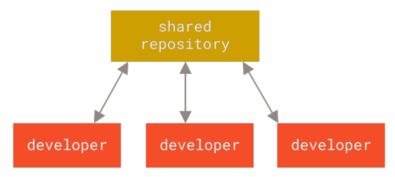
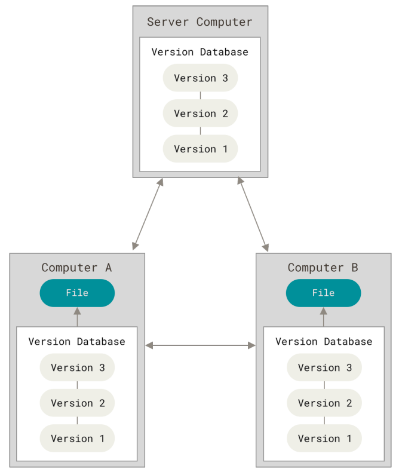
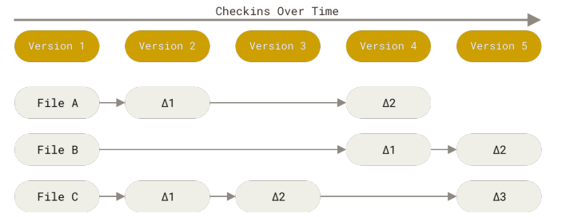
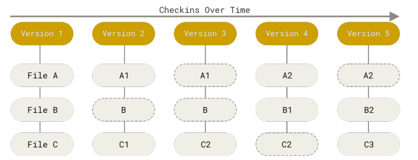

# Getting Started
This section will go over some background on version control tools and how to get Git running on your system.

## About Version Control
Version control is a system that records changes to a file or set of files over time so that you can recall specific version later. Most often done with software source code though this can be done with nearly any type of file on a computer.

### Local Version Control Systems
Local VCSs initially had a simple database that kept all the changes to files under revision control.

One of the most popular VCS tools was a system called RCS. RCS works by keeping patch sets(the differences between files) in a special format on disk. It can then recreate what any file looked like at any point in time by adding up all the patches.

### Centralized Version Control Systems
One issue with local control systems is the need to collaborate with developers on other systems. To deal with this problem, Centralized Version Control Systems(CVCSs) were developed. These systems have a single server that contains all the versioned files, and a number of clients that check out files from that central place. For many years this was the standard for version control.

This setup allows everyone to have an idea of what everyone else on the project is doing and gives administrators fine-grained control over who can do what.It's also easier to administer a CVCS than to deal with local databases on every client.

However there are also some serious downsides. The most obvious is the single point of failure that the centralized server represents. The server going down will prevent collaboration and saving of versioned changes. If the hard disk the central database is on becomes corrupted and proper backups haven't been kept you lose absolutely everything - the entire history of the project except whatever single snapshots people happen to have on their local machines. 

### Distributed Version Control Systems
This is where Distributed Version Control Systems(DVCSs) step in. In a DVCS, like Git or Mercurial, clients don't just check out the latest snapshot of the files. Rather, they fully mirror the repository, including its full history. Thus, if any server dies, and these systems were collaborating via that server, any of the client repositories can be copied back up to the server to restore it. Every clone is really a full backup of all the data.

These systems also deal pretty well with having several remote repositories they can with so you can collaborate with different groups of people in different ways within the same project. This allows you to setup several types of workflows that aren't possible in centralized systems, such as hierarchical models.

## What is Git?
Even though Git's user interface is fairly similar to other VCSs, Git stores and things about information in a very different way, and understanding these differences will help you avoid becoming confused while using it.

### Snapshots, Not Differences
The major difference between Git and any other VCS is the way Git thinks about its data. Most other systems store information as a list of file-based changes, commonly described as *delta-based* version control.

Git thinks of its data more like a series of snapshots of a miniature filesystem. Every time you commit, or save the state of your project Git basically takes a picture of what all your files look like at that moment and stores a reference to that snapshot. To be efficient if files have not changed, Git doesn't store the file again, just a link to the previous identical file it has already stored. 

This makes Git more like a mini filesystem with some incredible powerful tools built on top rather than a simple VCS. We'll look at some of the benefits you gain by thinking of your data this way when we cover [Git Branching](3_git_branching.md)

### Nearly Every Operation is Local
