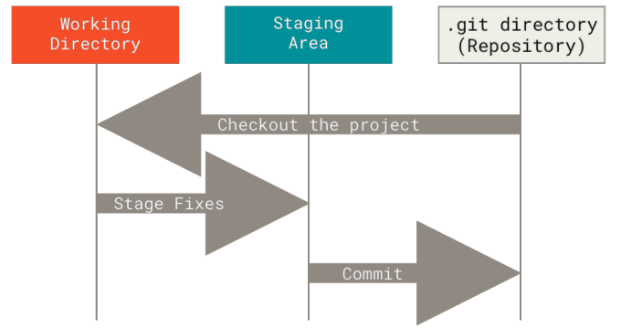

# Getting Started
This section will go over some background on version control tools and how to get Git running on your system.

## About Version Control
Version control is a system that records changes to a file or set of files over time so that you can recall specific version later. Most often done with software source code though this can be done with nearly any type of file on a computer.

### Local Version Control Systems
Local VCSs initially had a simple database that kept all the changes to files under revision control.

One of the most popular VCS tools was a system called RCS. RCS works by keeping patch sets(the differences between files) in a special format on disk. It can then recreate what any file looked like at any point in time by adding up all the patches.

### Centralized Version Control Systems
One issue with local control systems is the need to collaborate with developers on other systems. To deal with this problem, Centralized Version Control Systems(CVCSs) were developed. These systems have a single server that contains all the versioned files, and a number of clients that check out files from that central place. For many years this was the standard for version control.

This setup allows everyone to have an idea of what everyone else on the project is doing and gives administrators fine-grained control over who can do what.It's also easier to administer a CVCS than to deal with local databases on every client.

However there are also some serious downsides. The most obvious is the single point of failure that the centralized server represents. The server going down will prevent collaboration and saving of versioned changes. If the hard disk the central database is on becomes corrupted and proper backups haven't been kept you lose absolutely everything - the entire history of the project except whatever single snapshots people happen to have on their local machines. 

### Distributed Version Control Systems
This is where Distributed Version Control Systems(DVCSs) step in. In a DVCS, like Git or Mercurial, clients don't just check out the latest snapshot of the files. Rather, they fully mirror the repository, including its full history. Thus, if any server dies, and these systems were collaborating via that server, any of the client repositories can be copied back up to the server to restore it. Every clone is really a full backup of all the data.

These systems also deal pretty well with having several remote repositories they can with so you can collaborate with different groups of people in different ways within the same project. This allows you to setup several types of workflows that aren't possible in centralized systems, such as hierarchical models.

## What Is Git?
Even though Git's user interface is fairly similar to other VCSs, Git stores and things about information in a very different way, and understanding these differences will help you avoid becoming confused while using it.

### Snapshots, Not Differences
The major difference between Git and any other VCS is the way Git thinks about its data. Most other systems store information as a list of file-based changes, commonly described as *delta-based* version control.

Git thinks of its data more like a series of snapshots of a miniature filesystem. Every time you commit, or save the state of your project Git basically takes a picture of what all your files look like at that moment and stores a reference to that snapshot. To be efficient if files have not changed, Git doesn't store the file again, just a link to the previous identical file it has already stored. 

This makes Git more like a mini filesystem with some incredible powerful tools built on top rather than a simple VCS. We'll look at some of the benefits you gain by thinking of your data this way when we cover [Git Branching](3_git_branching.md)

### Nearly Every Operation Is Local
Most operations in Git need only local files and resources to operate. Because you have the entire history of the project right there on your local disk, most operations seem almost instantaneous.

To browse the history of the project, Git doesn't need to go out to the server to get the history - it simply reads it from your local database. 

This also means there is very little you can't do if you're offline or off VPN. You can still commit to your *local* copy until you get to a network connection to upload. This isn't possible with many other systems.

### Git Has Integrity
Everything in Git is checksummed before it is stored and is then referred to by the checksum. This means it is impossible to change the contents of any file or directory without Git knowing about it. 

The mechanism that Git uses for this checksumming is called a SHA-1 hash. This is a 40 character string composed of hexadecimal characters and calculated based of a file or directory structure in Git.

### Git Generally Only Adds Data
When you do actions in Git, nearly all of them only *add* data to the Git database. It is hard to get the system to do anything that is not undoable or to make it erase data in any way. As with any VCS you can lose or mess up changes you haven't committed yet but after you commit a snapshot into Git, it is very difficult to lose, especially if you regularly push your database to another repository. This also gives confidence that we can experiment without the danger of severely screwing things up. 

### The Three States
Git has three main states that your files can reside in: *modified, staged, and committed*:
- Modified means that you have changed the file but have not committed it to your database yet.
- Staged means that you have marked a modified file in its current version to go into your next commit snapshot.
- Committed means that the data is safely stored in your local database.

This leads us to the three main sections of a Git project: the working tree, the staging area, and the Git directory.

The working tree is a single checkout of one version of the project. These files are pulled out of the compressed database in the Git directory and placed on disk for you to use or modify.

The staging area is a file, generally contained in your Git directory that stores information about what will go into your next commit. Its technical name in Git parlance is the "index", but the phrase "staging area" works just as well.

The Git directory is where Git stores the metadata and object database for your project. This is the most important part of Git, and it is what is copied when you *clone* a repository from another computer. 

This basic Git workflow is as follows:
- You modify files in your working tree.
- You selectively stage just those changes you want to be part of your next commit, which adds *only* those changes to the staging area.
- You do a commit, which takes the files as they are in the staging area and stores that snapshot permanently to your Git directory. 

If a particular version of a file is in the Git directory it is considered *committed*. If it has been modified and was added to the staging area, it is *staged*. And if it was changed since it was checked out but has not been staged, it is *modified*.

## First-Time Git Setup
Git comes with a tool called `git config` that lets you get and set configuration variables that control all aspects of how Git looks and operates. These variables can be stored in three different places:
- `[path]/etc/gitconfig`: Contains values applied to every user on the system and all their repositories. If you pass the option `--system` to `git config` it reads and writes from this file specifically.
- `~/.gitconfig` or `~/.config/git/config`: Values specific personally to you, the user. You can make Git read and write to this file by passing the `--global` option. This affects all of the repositories you work with on your system
- `config` file in the Git directory (`.git/config`) of whatever repository you're currently using: Specific to that single repository. You read and write from this file using the `--local` option which is the default.

You can view all of your setting and where they are coming form using: `git config --list --show-origin`

