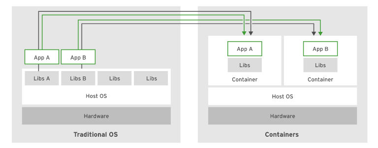

# Introducing Container Technology
Software applications typically depend on other libraries, configuration files, or services provided by the runtime environment. The traditional runtime environment is a physical host or a VM with application dependencies installed on the host.

The major drawback to this approach is that the application's dependencies are closely related to the runtime environment. Updates or patches to the OS may break the application. 

Additionally, traditionally deployed applications must be stopped before updating the associated dependencies. To minimize downtime organizations need to implement complex systems to provide high availability.

Alternatively, an application can be deployed using a container. A container is a set of one or more processes that are isolated from the rest of the system.

Containers provide many of the same benefits of VMs, such as security, storage, and network isolation but require far fewer resources and are quick to start and terminate. 

The Open Container Initiative(OCI) provides a set of industry standards that define a container runtime specification and a container image specification. An OCI compliant container image can be executed using an OCI-compliant container engine.

The following are major advantages of using containers:
- **Low hardware footprint**
- **Environment isolation** 
- **Quick deployment**
- **Multiple environment deployment**
- **Reusability**

Next section: [Overview of Container Architecture](./1.2_overview_of_container_architecture.md)
