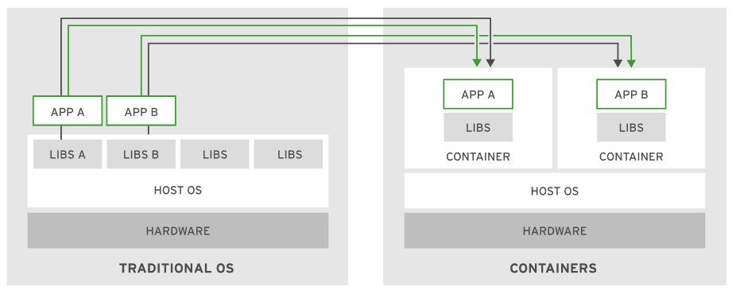

# Introduction and Overview of Containers
A container is an encapsulated process that includes the required runtime dependencies for the program to run. Within a container, application specific libraries are independent of the host operating system libraries. Libraries and functions not specific to the containerized application are provided by the operating system and kernel.

A container engine creates a union file system by merging container image layers. Because container image layers are immutable, the container engine adds a writable layer for the runtime file modifications. Containers are *ephemeral* by default, meaning that the container engine removes the writable layer when you remove the container.

Containers use Linux kernel features, such as namespaces and Control Groups(cgroups). Containers use cgroups for resource management(CPU allocation, memory, etc.) and namespaces provide functionality to isolate processes within containers from each other and the host system.

### Images vs Instances
A *container image* contains effectively immutable data that defines an application and its libraries. Container images can be used to create *container instances*, which are executable versions of the image that includes references to networking, disks, and other runtime necessities.

## Comparing Containers and Virtual Machines
Containers generally serve a similar role to virtual machines(VMs), where an application resides in a self-contained environment with virtualized networking for communication. However, containers are much lighter and faster to start up. For both memory and disk usage, VMs are usually measured in gigabytes, whereas containers are measured in megabytes.

VMs are useful when an additional full computing environment is required, such as when an application requires specific, dedicated hardware. It is also preferable when an application requires a non-Linux operating system or a different kernel from the host.

A VM that runs one one hypervisor is usually not guaranteed to run on a different hypervisor. In contrast, containers that follow the OCI specification do not require a particular container engine to function. 

## Development for Containers
Containerization provides many advantages for the development process, such as easier testing and deployments, by providing tools for stability, security, and flexibility.

### Testing and Workflows
A developer can write software and test locally, then deploy the finished application to a cloud server or dedicated cluster with few or no changes. Additionally, developers can take advantage of CI/CD pipelines to deploy containers to various environments.

### Stability
Container images are a stable target for developers. Software applications require specific version of libraries to be available for deployment which can result in dependency issues or specific OS requirements. Because libraries are included in the container image, a developer can be confident of no dependency issues in a deployment. 

# Introduction to Kubernetes and OpenShift

## Kubernetes Overview

